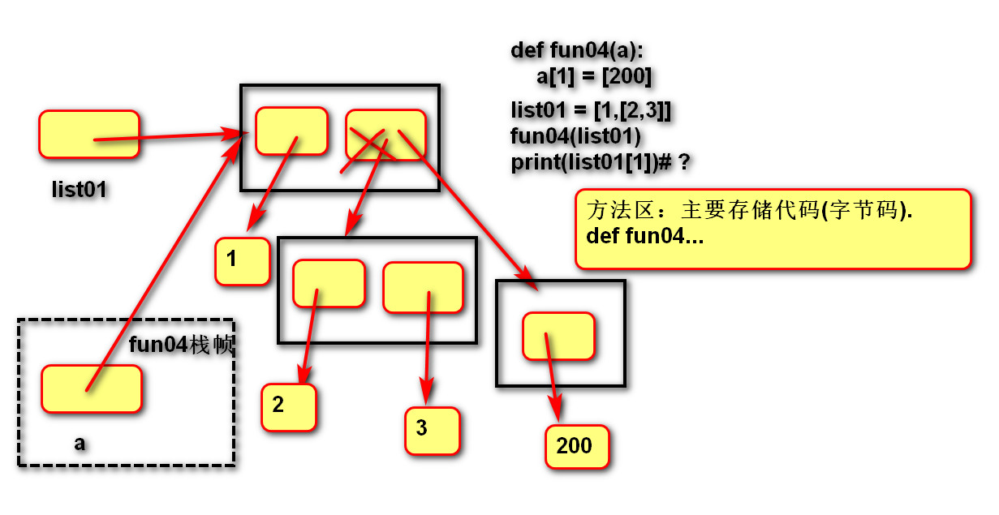

# 第七章 Python函数

​	函数用于封装一个特殊的功能，表示一个功能或者一个行为。它是可以重复执行的代码块，可以重复被调用。这样就可以提高代码的可重用性和可维护性，使代码的层次结构更加清晰。


## 1.定义函数 

- **语法**

```python
def 函数名(形式参数):
	函数体
```

- 说明

  - def是关键字，全称define，意为定义；
  - 函数名：对函数体中语句的描述，规则与变量名相同；
  - 形式参数：方法定义这要求调用者提供的信息；
  - 函数体：完成该功能的语句。

- **调用函数**

  - 语法

  ```python
  函数名(实际参数)
  ```

  - 实际参数需要根据形式参数传递内容。

- **返回值**

  - 定义：方法定义者告诉调用者的结果
  - 语法：

```python
return 需要返回的数据
```

函数能让我们的程序更加的灵活：

```python
def weather():
    print("日期：4月20日")
    print("温度：10-28℃")
    print("空气状况：良")

weather()

def m_weather(today, temp,air):
    print(f"日期：{today}")
    print(f"温度：{temp}")
    print(f"空气质量：{air}")

m_weather("4月20号", "20℃", "优")
```


说明：**return后没有数据相当于None，函数体没有return，相当于None。**

```python
# 函数返回值
def fun01(acount):
    print("fun01()执行了")
    return 20
	# print("fun01()又执行了") # return后的语句不会执行

re = fun01(10)
print(re)

# 无返回值函数
def fun02(a):
    print("fun02()执行了")


re02 = fun02(100)
print(re02)  # None
```

```python
"""
    函数返回值的应用
    需求：定义两个数值相加求和的函数
"""
# def add():
#     num1 = int(input("请输入第一个数值："))
#     num2 = int(input("请输入第二个数值："))
#     result = num1 + num2
#     print(result)
# add()
# 函数的核心思想：干一件事，分而治之
def add(num1, num2):
    result = num1 + num2
    # print(result)
    return  result

num1 = int(input("请输入第一个数值："))
num2 = int(input("请输入第二个数值："))
num = add(num1, num2)
print("两数之和是："+ str(num))
```


## 2.传参

​	函数的传参有两种：不可变类型和可变类型参数。不可变类型参数包括：数值型(整数、浮点数、复数)、布尔型、空值、字符串、元组、固定集合；可变类型参数有：列表、字典、集合。不可变类型的数据传参时，函数内部不会改变原数据的值，可变类型数据类型传参时，函数内部可以改变原数据。

```python
def print_rectangle(r_count, c_count, char):
    """
        打印矩形
    :param r_count: 行数
    :param c_count: 列数
    :param char: 填充的字符　
    """
    for r in range(r_count,c_count):
        # 内层循环控制列　
        for c in range(r):
            print(char, end=" ")
        print()

print_rectangle(1, 5, "*")
```


## 3.函数内存图

```python
# 在方法区中存储函数代码,不执行函数体
def fun01(a):
    a = 100

num01 = 1
# 因为调用函数，所以开辟一块内存空间，叫做栈帧
# 用于存储在函数内部定义的变量(包含参数).
fun01(num01)
# 函数执行完毕后，栈帧立即释放(其中定义的变量也会销毁).
print(num01) #1

def fun02(a):
    # 改变的是传入的可变对象
    a[0] = 100

list01 = [1]
fun02(list01)
print(list01[0]) # 100

def fun03(a):
    # 改变的是fun03栈帧中变量a的指向
    a = 100

list01 = [1]
fun03(list01)
print(list01[0])# 1
```





## 4.作用域LEGB

​	函数中变量的作用域就是它起作用的范围，作用域有4中分类：局部作用域Local--函数内部；外部嵌套作用域Enclosing--函数嵌套；全局作用域global--模块(.py文件)内部；内置模块作用域Builtin--builtins.py文件内。

```python
# 函数的作用域
g01 = "ok"  # 全局变量：在整个py文件里有效
print(g01)
def fun01():
    l01 = 100  # 局部变量：在函数内部定义的变量
#print(l01)  # 在函数外部无法识别局部变量
    # print(g01)  # 在函数内部可以读取全局变量
    print(l01)
    # g01 = "no"  # 这是一个局部变量,而不是修改全局变量
    global g01  # 在函数内想要声明一个全局变量，需要加上global关键字
    g01 = "no"
    print(g01)  # no--g01就是不同一个

fun01()
print(g01)  # ok
```


​	变量名的查找规则是由内到外：L->E->G->B。在访问变量时，先查找本地变量，然后是包裹此函数的内部变量，之后是全局变量，最后是内置变量。


### 4.1.局部变量

​	定义在函数内部的变量(形参也是局部变量)，只能在函数内部使用，调用函数时才被创建，函数结束后自动销毁。


### 4.2.全局变量

​	定义在函数外部，模块内部的变量，在整个.py文件范围内有效，但需要注意的是不能在函数内将其直接赋值。如果要在函数内声明全局变量，需要用到global关键字定义。在函数内使用global关键字定义全局变量时，视为创建新的变量，不能先声明局部变量再使用global关键字声明全局变量。

​	**语法：**

```python
global 变量1,变量2.....
```


### 4.3.练习

​	记录一个函数的调用次数。

```python
# 记录函数的调用次数
# 定义计数器
count = 0
def fun01():
    global count
    count += 1

fun01()
fun01()
fun01()
fun01()
fun01()
print("调用"+str(count)+"次")
```


## 5.函数参数

​	函数的参数的传递方式分为实参(argument)传递，形参(parameter)传递


### 5.1.实参传递方式

​	实参的传递分为位置实参、关键字实参、序列实参、字典实参。

```python
# 函数参数的传递--实参argument
def fun01(a, b, c, d):
    print(a)
    print(b)
    print(c)
    print(d)


# 位置实参：实参与形参的位置一一对应
# fun01(1, 2, 3, 4)
# 关键字实参：实参与形参通过名称对应-个数必须相同
# fun01(b=1, d=2, c=3, a=4)
# 序列实参：用*表示，*将序列拆分后按位置与形参对应
# 如果参数很多，可以存储在序列(字符串/列表/元组)中，再通过*拆分
list01 = ["a", "b", "c", "d"]
# fun01(*list01)
# 字典实参：用**表示，**将字典拆分后按名称与形参进行对应
# 如果参数很多可以存储在字典中，再通过**拆分
dict01 = {"a": 1, "b": 2, "c": 3, "d": 4}
fun01(**dict01)
```


### 5.2.形式参数的创建

​	形式参数的创建分为缺省(默认)参数、位置形参、星号元组形参、命名关键字形参、字典形参。

```python
# 函数参数的传递--形参parameter
def fun01(a=0, b=0, c=0, d=0):
    print(a)
    print(b)
    print(c)
    print(d)


# fun01(b=2, c=3) 如果形参为默认创建参数个数必须对应，否则报错
# 缺省参数：如果实参不传递，可以使用默认值
# fun01(b=2, c=3)  # 将形参初始化后不报错


# fun01(2, 3)  # 如果不按关键字会按位置对应传递

# 位置形参
def fun02(a=0, b=0, c=0, d=0):
    print(a)
    print(b)
    print(c)
    print(d)


# 星号元组形参：*将实参合并成一个元组，再传给形参-收集多余位置的参数
# 形参的命名一般为args
def fun03(*args):
    print(args)


fun03()  # ()
fun03(1)  # (1,)
fun03(1, "2")  # (1, '2')


# 命名关键字形参:在*元组位置后的形参
# 目的：要求实参必须是关键字实参
def fun04(a, *args, b):
    print(a)
    print(args)
    print(b)


fun04(1, b=2)
fun04(1, 2, 3, 4, b=2)

def fun05(*, a, b):
    print(a)
    print(b)


print(fun05(a=1, b=2))

# 字典形参： 必须传递关键字，**的目的是将实参合并为字典
# 目的：实参可以传递数量无限的关键字实参
def fun06(**a):
    print(a)


print(fun06(a=1, b=2))
```


**练习：**

```python
# 练习：定义函数，根据小时分钟秒，计算总秒数
# 要求：可以计算小时-->秒，也可以分钟-->秒
# 可以计算小时+分钟-->秒，也可以计算小时+秒-->秒

def get_total_second(hour=0, minute=0, second=0):
    return hour * 3600 + minute * 60 + second


# 小时，分钟，秒，
print(get_total_second(1, 1, 1))
# 小时，分钟
print(get_total_second(2, 3))
# 分钟，秒，
print(get_total_second(minute=2, second=3))
# 小时，
print(get_total_second(2))
# 分钟，
print(get_total_second(minute=2))
```

```python
# 练习：定义函数，数值相加的函数
def adds(*args):
    # result = 0
    # for item in args:
    #     result += item
    # return result

    return sum(args)


print(adds(1, 22, 3, 3, 4, 5, 6))
print(adds(1, 4, 5, 6))
```


