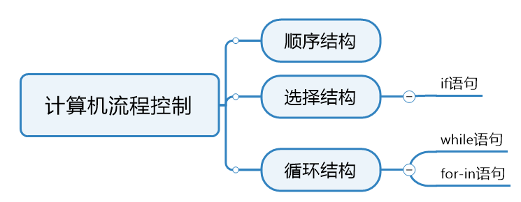
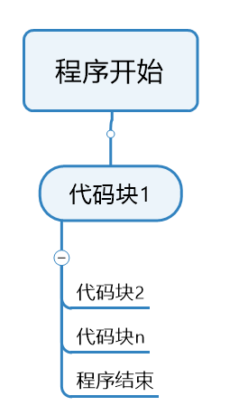

# 第三章 Python流程控制


## 1.程序的组织结构

​	1996年，计算机科学家证明了任何简单或复杂的算法都可以由顺序结构、选择结构和循环结构这三种基本机构组成。



## 2.顺序结构

​	顺序结构就是程序按从上到下的顺序执行代码，中间没有任何的判断和跳转，知道程序结束。



```python
print('1.程序开始')
print('2.冰箱打开')
print('3.把大象放进去')
print('4.关闭冰箱')
print('5.结束程序')
```


## 3.对象的布尔值

​	在Python中，一切皆为对象，而每一个对象都有一个布尔值，我们可以使用内置函数bool()获取对象的布尔值。以下对象的布尔值为False：

False、数值0、None、空字符串、空列表、空元组、空字典、空集合。

```python
# 测试对象的布尔值
print(bool(False))
print(bool(0), bool(0.0))
print(bool(None))
print(bool(''), bool(""))
print(bool([]))  # 空列表
print(bool(list()))  # 空列表
print(bool(()))  # 空元组
print(bool(tuple()))  # 空元组
print(bool({}))  # 空字典
print(bool(dict()))  # 空字典
print(bool(set()))  # 空集合
# 除以上布尔值为False，其他的都为True
```


## 4.选择结构

​	程序根据判断条件的布尔值选择性的执行部分代码，明确让计算机知道在什么条件下，该去做什么。


​	而选择结构因其功能性的不同分为单分支、双分支和多分支，单分支的结构类似如果.....就.......，语法结构为：

```python
if 条件表达式:
    条件执行体
```


```python
# 单分支条件表达式
money = 1000  # 余额
s = int(input('请输入取款金额'))  # 取款金额s
# 判断余额是都充足
if money >= s :
    money = money - s
    print('取款成功，余额为：', money)
```

​	双分支结构的语义类似：如果....不满足.....就....，其语法结构为：

```python
if 条件表达式 :
    条件执行体1
else :
    条件执行体2
```


```python
# 双分支条件
# 从键盘录入整数，让计算机判断是奇数还是偶数
num = int(input('请输入一个整数'))

# 条件判断
if num % 2 == 0:
    print(num, '是偶数')
else:
    print(num, '是奇数')
```

​	多分支结构的中文语义类似：是....吗？不是；是...吗？不是；是...吗？是。语法结构为：

```python
if 条件表达式1:
    条件执行体1
elif 条件表达式2:
    条件执行体2
elif 条件表达式N:
    条件执行体N
[else:]
	条件执行体N+1
```


```python
# 多分支判断
""" 判断成绩
从键盘录入一个整数成绩进行判断
90-100 A
80-89 B
70-79 C
60-69 D
0-59 E
"""
score = int(input('请输入成绩：'))
if 90 <= score <= 100:
    print('A')
elif 80 <= score <= 89:
    print('B')
elif 70 <= score <= 79:
    print('C')
elif 60 <= score <= 69:
    print('D')
elif 0 <= score <= 59:
    print('E')
else:
    print('请输入0-100以内的成绩')
```


## 5.嵌套if

​	在实际开发的过程中常常会使用到双重if语句j进行双重分析，它的基本结构如下：

```python
if 条件表达式1:
    if 内层条件表达式:
        内层条件执行体1:
    else:
        内层条件执行体2:
else:
    条件执行体
```

​	其中外层表达式的结果为布尔值，如果是True的话，才会执行内存条件表达式。

```python
# 嵌套if分支
"""
    会员打折：>=200 8折  >=100  9折
    非会员打折：>=200 9.5折  其他不打折
"""
answer = input('您是会员吗？y/n')
money = float(input('请输入您的购物金额:'))
# 外层判断是否是会员
if answer == 'y':
    if money >= 200:
        print('8折后付款金额为:', money * 0.8)
    elif money >= 100:
        print('9折后付款金额为:', money * 0.9)
    else:
        print('没有折扣，付款金额为:', money)
else:
    if money >= 200:
        print('95折后付款金额为:', money * 0.95)
    else:
        print('付款金额为:', money)
```


作业：输入两个数，判断它们的大小。


## 6.pass语句

​	pass语句什么都不做，只是一个占位符，用在语法上需要语句的地方。它在我们建立了语法结构，但还没想好怎么写代码的时候使用。常配合的语法有：if语句的条件执行体、for-in语句的循环体、定义函数时的函数体。

```python
# pass语句:只是一个占位符，用到需要语句的地方
answer = input('您是会员吗？y/n')
# 判断是否为会员
if answer == 'y'
    pass
else:
    pass
```


## 7.range()函数

​	Python的内置函数range()函数用于生成一个整数序列，它的返回值是一个迭代器对象。不管range对象表示的整数序列有多长，所有range对象占用的内存空间都是相同的，因为仅仅需要存储start、stop和step，只有当用到range对象时，才回去计算序列中的相关元素。使用range()函数时，也可以使用in与not in判断整数序列中是否存在(不存在)指定的整数序列。创建range对象的三种方式：

- **range(stop)**：创建一个以(0,stop)之间的整数序列，步长为1；
- **range(start,stop)**：创建一个(start,stop)之间的整数序列，步长为1；
- **range(start,stop,step)**：创建一个(start,stop)之间的序列，步长为step。


## 8.循环结构

​	反复做一件事就是循环。Python中的循环有两种:while循环和for-in循环。


### 8.1.while循环

​	之前我们学习if判断的时候是if判断一次，条件为True执行一次；而while循环是判断N+1次，条件为True执行N次。它的语法结构如下：

```python
while 条件表达式:
    条件执行体（循环体）
```

```python
# while循环
a = 1
# 判断条件
while a < 10:
    print(a)
    a += 1
```


​	while循环的执行流程一共分为四步：初始化变量、条件判断、条件执行体、改变变量


​	计算0-4之间的和：

```python
# 计算0-4之间的和
sum = 0  # 用于存储累加
# 1.初始化变量0
i = 0
# 2.条件判断<5
while i < 5:
    # 3.条件执行体
    sum += i
    # 4.改变变量
    i += 1
print('和为：', sum)
```


​	


### 8.2.for - in循环

​	for -in循环类似于Java中的for循环，in表达从（字符串、序列）中依次取值，又称为遍历。需要注意的是for-in遍历的对象必须是可迭代的对象。其语法结构为：

```python
for 自定义变量 in 可迭代对象:
    循环体
```


​	**for-in循环中的循环体不需要访问自定义变量，可以将自定义变量替代为下划线。**

```python
# for-in循环
for item in 'Python':
    print(item)
    
# range()产生的是一个整数序列，也可以被迭代
for _ in range(10):
    print('人生苦短，快用Python')
```

​	练习：输出100-999之间的水仙花数-153，个位的三次方+十位的三次方+百位三次方=这个数

```python
# 打印100-999之间的水仙花数
for item in range(100,1000):
    ge = item % 10
    shi = item // 10 % 10
    bai = item // 100
    # print(bai, shi, ge)
    # 判断
    if ge ** 3 + shi ** 3 + bai ** 3 == item:
        print(item)
        
# 结果
153
370
371
407
```


**作业：分别用while和for-in循环求1-100之间偶数的和。**


### 8.3.break语句

​	break语句用于结束循环结构，通常与if分支一起使用。其结构如下：

```python
# for-in循环
for ...in ...:
    ......
    if ...
      break
       
# while循环
while(条件):
    ......
    if ...:
        break
```

for-in循环配合break使用：

```python
"""
break语句的使用
从键盘录入密码，最多录入3次，如果正确就结束循环
"""
for item in range(3):
    password = input('请输入密码：')
    if password == '123456':
        print('密码正确')
        break
    else:
        print('密码不正确')
```

while循环配合break使用：

```python
# while循环
a = 0
while a < 3:
    password = input('请输入密码：')
    if password == '123456':
        print('密码正确')
        break
    else:
        print('密码不正确')
    a += 1
```


### 8.4.continue语句

​	continue语句用于结束当前循环，进入下一次循环，通常与分支if一起使用。其语法结构如下：

```python
# for循环
for...in...:
    ......
    if ...:
        continue
        
# while循环
while(条件):
    ......
    if ...:
        continue
```

 

```python
# continue语句--要求输出1-50之间5的倍数
"""for item in range(1,51):
    if item % 5 == 0:
        print(item)
"""
for item in range(1,51):
    if item % 5 != 0:
        continue
    print(item)
```


### 8.5.else语句

​	对于else语句，大家并不陌生，在Java、PHP中等语言中通常都是和if条件语句配合，但在Python中的用法有一些不同，和else搭配的方式有三种：


```python
# else语句-输入3次密码
# 与for搭配
for item in range(3):
    password = input('请输入密码：')
    if password == '123456':
        print('密码正确')
        break
    else:
        print('密码不正确')
else:
    print('对不起！三次密码均输入错误！')

# 与while搭配
a = 0
while a < 3:
    password = input('请输入密码：')
    if password == '123456':
        print('密码正确')
        break
    else:
        print('密码不正确')
    a += 1
else:
    print('对不起！三次密码均输入错误！')
```


### 8.6.嵌套循环语句

​	循环结构中又嵌套了另外的完整的循环结构，其中内层循环作为外层循环的循环体执行。

```python
while...:
    ...
    for...:
       ...
    else:
        ...
```

```python
# 嵌套循环
# 输出3行4列的矩形
for i in range(1, 4):  # 执行3次，一次一行
    for j in range(1, 5):
        print('*', end='\t')  # 不换行输出
    print()  # 打印行
```

```python
# 打印这叫三角形-类似99乘法表
for i in range(1,10):  # 打印9行
    for j in range(1, i+1):  # 第几行打印几个*
        print('*', end='')
    print()
```

改造99乘法表：

```python
# 打印99乘法表
for i in range(1, 10):  # 打印9行
    for j in range(1, i+1):  # 第几行打印几个*
        print(i, '*', j, '=', i*j, end='\t')
    print()
```


### 8.7.嵌套循环与break和continue配合使用

​	在嵌套循环中，break和continue用于控制本层的循环。如果内层循环中使用了break，那么直接跳出内循环，执行外循环；如果内循环中使用了continue，那么需要继续执行完内循环后再执行外循环。


```python
# 嵌套循环和break和continue之间的配合使用
for i in range(5):
    for j in range(1, 11):
        if j % 2 == 0:
            # break
            continue
        print(j)
```

