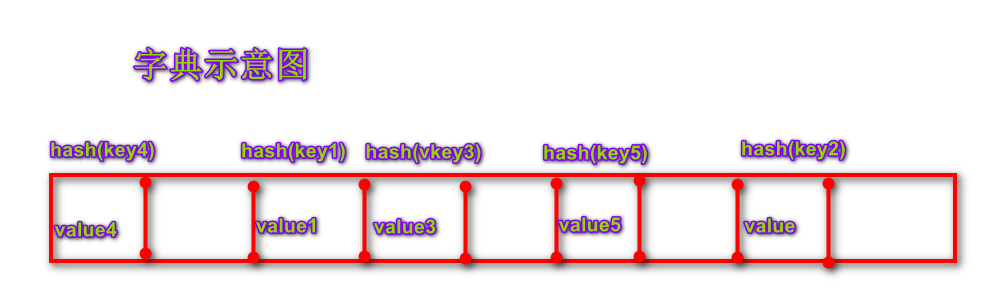

# 第五章 Python字典与元组


## 1.什么是字典

​	**字典**是Python内置数据结构之一，与列表一样是一个可变序列。它以键值对(key-value)的方式储存，是一个无序的序列。格式如下：

```python
dictionary = {'key1':value1, 'key2':value2, 'key3':value3}
其中：dectionary是字典名，字典元素用{}来包裹，key:value之间用冒号分隔，每个键值对之间用逗号隔开
```



​	**字典的实现原理和查字典类似，查字典是根据部首或拼音查找对应页码，Python中字典是根据key查找value所在的位置。**


## 2.创建字典

​	创建字典和创建列表一样，有两种方式：

- 使用花括号的方式：

```python
gdp = {'四川': 5000, '湖北': 4500, '福建': 4400, '北京': 3000}
print(gdp)
print(type(gdp))
```

- 使用内置函数dict():

```python
student = dict(name='micheal', age=20)
print(student)
```

- 创建空字典：

```python
d = {}
print(d)
```


## 3.字典的查询

​	获取字典元素的方式有两种：

```python
[]取值------>gdp['四川']
get()方法-------->gdp.get('四川')
```

- []取值和使用get()取值的区别
  - []如果字典中不存在指定的key，则抛出KeyError异常；
  - get()方法取值，如果字典中不存在指定的key，不会抛出KeyError，而是返回None，可以通过参数设置默认的value，以便指定的key不存在时返回。

```python
# 字典的获取-[]
gdp = {'四川': 5000, '湖北': 4500, '福建': 4400, '北京': 3000}
print(gdp['四川'])
# print(gdp['重庆'])  # KeyError: '重庆'

# 字典的获取-get()
s = gdp.get('四川')
print(s)
c = gdp.get('重庆')
print(c)  # None
print(gdp.get('广东', 8000))  # 8000是广东不存在是提供的默认值
```


## 4.字典元素的判断和元素删除

​	字典key的判断可以用in和not in来判断。

```python
# 判断元素是否存在与字典中
gdp = {'四川': 5000, '湖北': 4500, '福建': 4400, '北京': 3000}
print('福建' in gdp)
print('北京' not in gdp)
```

​	删除字典元素可以用del来删除指定元素，删除的是整个键值对：

```python
del gdp['北京']
print(gdp)
```

​	同样可以用clear()方法清空整个字典：

```python
gdp.clear()
print(gdp)
```


## 5.新增、修改字典元素

​	新增字典元素只需要将字典中增减对应键值对就可以了.

```python
# 新增
gdp = {'四川': 5000, '湖北': 4500, '福建': 4400, '北京': 3000}
gdp['江苏'] = 7800
print(gdp)
# 修改
gdp['江苏'] = 8000
print(gdp)
```


## 6.字典的视图操作

​	获取字典视图的三个方法：


```python
# 获取字典视图
gdp = {'四川': 5000, '湖北': 4500, '福建': 4400, '北京': 3000}
keys = gdp.keys()
print(keys)
print(type(keys))
print(list(keys))  # 将所有key组成的视图转成列表
values = gdp.values()
print(values)
print(type(values))
print(list(values))
items = gdp.items()
print(items)
print(list(items))  # 元组
```


## 7.字典元素的遍历

​	遍历的方式如下：

```python
for item in gdp:
    print(item)
```

```python
# 获取字典视图
gdp = {'四川': 5000, '湖北': 4500, '福建': 4400, '北京': 3000}
for item in gdp:
    print(item, gdp[item])
```


## 8.字典的特点

​	字典的特点有如下几个：

- 字典中所有的元素都是一个key-value对，key不允许重复，value可以重复；
- 字典中的元素是无序的；
- 字典中的key必须是不可变对象；
- 字典也可以根据需要动态伸缩；
- 字典会浪费较大的内存，是一种使用空间换时间的数据结构。

```python
# 字典的特点
student = {'name': '张三', 'name': '李四'}
print(student)
"""student = {'name': '张三', 'name': '张三'}
print(student)"""
lst = [10, 20, 30]
lst.insert(1, 100)
print(lst)
student = {lst:100}
print(student)  # TypeError: unhashable type: 'list'
```


## 9.使用字典生成式

​	在Python中也可以使用内置函数zip()来生成字典。它用于将可迭代对象作为参数，将对象中对应的参数打包成一个元组，然后返回这些由元组组成的列表。

```python
items = ['Fruits', 'Books', 'Others']
prices = [100, 101, 102]
s = {item.upper(): price for item, price in zip(items, prices)}
print(s)
```

```python
item.upper():price是遍历出来的单个对象组成键值对的形式，并全部转换成大写；
for item,price表示遍历的变量
zip(items,prices)表示打包的列表对象。
```


## 10.元组-tuple	

​	元组是由一系列变量组成的不可变的序列容器。不可变是指一旦创建，不可以再添加/删除/修改元素。


### 10.1.元组的基本操作

- **创建元组**

  - 创建空元组

  ```python
  元组名 = ()
  元组名 = tuple()
  ```

  - 创建非空元组

  ```python
  元组名 = (10,)
  元组名 = (10,20,30)
  元组名 = 10,20,30
  元组名 = tuple(可迭代对象)
  ```


- **获取元素**

  - 索引
  - 切片

- **遍历元组**

  - 正向

  ```python
  for 变量名 in 列表名:
  		变量名就是元素
  ```

  

  - 反向

  ```python
  for 索引名 in range(len(列表名)-1,-1,-1):
  		元祖名[索引名]就是元素
  ```

  ```python
  # 1.创建元组
  tuple1 = ()  # 空元组
  tuple2 = tuple()
  
  # 2.创建具有默认值的元组
  tuple3 = (1, 2, 3)
  print(tuple3)
  
  # 3.列表-->元组
  tuple1 = tuple(['a', 'b'])
  # 4.元组-->列表
  list01 = list(tuple1)
  
  # 5.如果元组只有一个元素，需要在元素后加逗号
  tuple4 = (100)
  print(type(tuple4))  # <class 'int'>
  tuple5 = (100,)
  print(type(tuple5))  # <class 'tuple'>
  
  # 6.获取元素（索引、切片）
  tuple01 = ("a", "b", "c", "d")
  e01 = tuple01[0]
  print(e01)
  print(type(e01))
  e01 = tuple01[-2:]
  print(e01)
  print(type(e01))
  
  tuple02 = (100, 200)
  a, b = tuple02
  print(a)
  print(b)
  
  # 7.遍历元组
  for item in tuple02:
      print(item)
  
  # 反向遍历
  for i in range(len(tuple02)-1, -1, -1):
      print(tuple02[i])
  ```


### 10.2.元组的作用

1. 元组与列表都可以存储一系列变量，由于列表会预留内存空间，所以可以增加元素。
2. 元组会按需分配内存，所以如果变量数量固定，建议使用元组，因为占用空间更小。
3. 应用：
   1. 变量交换的本质就是创建元组：x, y =(y, x)
   2. 格式化字符串的本质就是创建元祖："姓名:%s, 年龄:%d"  % ("micheal", 15)


### 10.3.练习

```python
"""
    练习:借助元组完成下列功能.
"""
# month = int(input("请输入月份："))
#
# if month < 1 or month > 12:
#     print("输入有误")
# elif month == 2:
#     print("２８天")
# elif month == 4 or month == 6 or month == 9\
#         or month == 11:
#     print("３０天")
# else:
#     print("３１天")

# 方式１：元组
# month = int(input("请输入月份："))
#
# if month < 1 or month > 12:
#     print("输入有误")
# elif month == 2:
#     print("２８天")
# elif month in (4,6,9,11):
#     print("３０天")
# else:
#     print("３１天")

# 方式2:
month = int(input("请输入月份："))
if month < 1 or month > 12:
    print("输入有误")
else:
    # 将每月天数存入元组
    day_of_month = (31, 28, 31, 30, 31, 30, 31, 31, 30, 31, 30, 31)
    print(day_of_month[month - 1])
```

