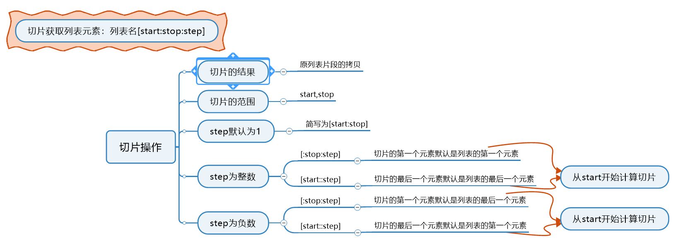
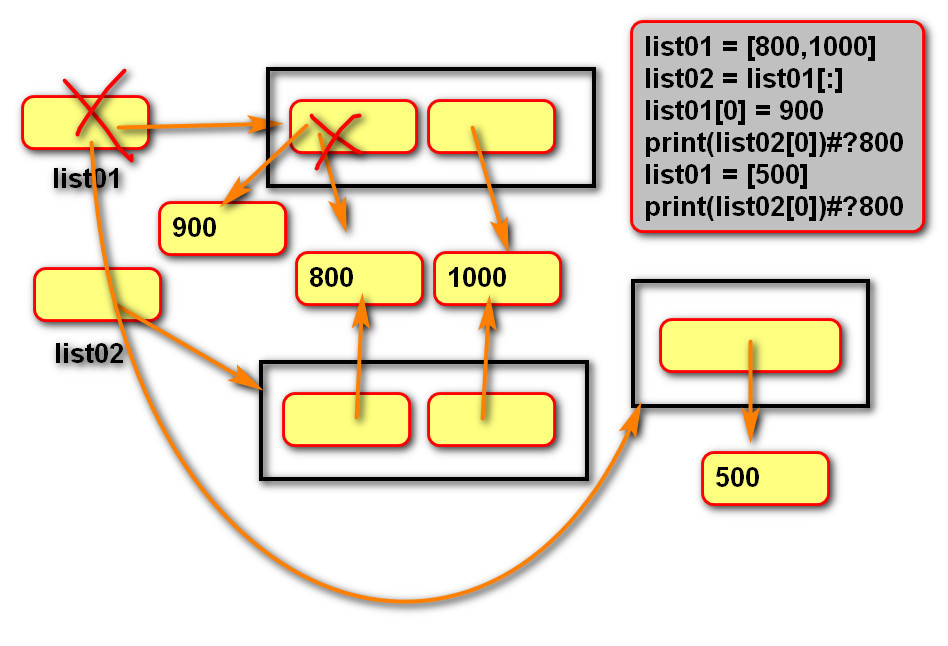
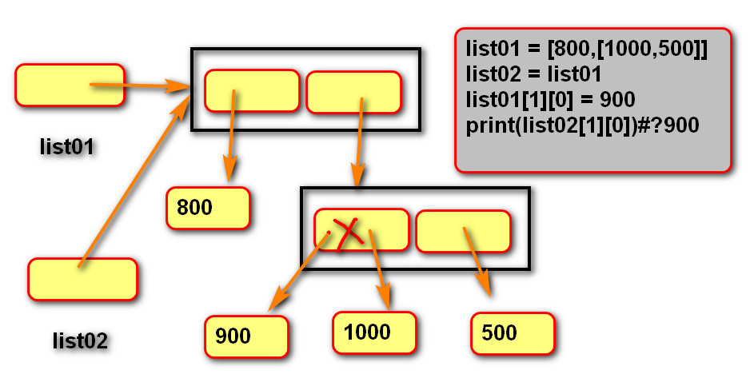

# 第四章 Python列表


## 1.列表

​	之前我们所学的变量只能存储一个元素，而列表是一个容器，可以存储N个元素，程序可以方便的对这些数据进行整体操作。它相当于Java，PHP等语言中的数组。如下图为列表示意图：


​	

```python
lis = ['hello','world',123,22.22,'python',11,0]
```

```python
# 列表
a = 10  # 变量只能存储一个元素
lis = ['hello', 'world, 100]
print(id(lis))
print(type(lis))
print(lis)
```


## 2.列表的创建

​	列表的创建需要使用到中括号[]，元素与元素之间用逗号进行分隔。当然也可以使用Python中的内置函数list()来创建列表。


```python
# 第一种方式
lst = ['hello', 'world']
# 第二种方式
lst = list(['hello', 'world'])
```


## 3.列表的特点

​	列表和Java中的数组类似，有如下几个特点：

- 列表元素按顺序有序排列；
- 索引映射唯一一个元素；
- 列表可以存储重复数据；
- 任意数据类型混存；
- 根据需要动态分配和回收内存。

```python
# 列表
lst = list(['hello', 'world', 123, 'world', 88.88])
print(lst)
print(lst[0], lst[-3])
```


## 4.列表的查询操作

​	列表的查询操作有两种方式：获取列表指定元素的索引、获取列表中单个元素和获取列表多个元素：

- **获取列表指定元素的索引**


- **获取列表中的单个元素**


```python
# 列表的索引
lst = list(['hello', 'world', 123, 'world', 88.88])
# 1.获取指定元素的索引
print(lst.index('world'))
# print(lst.index('Python'))
print(lst.index(123, 2, 4))  # 指定范围内查找123

# 根据索引获取指定元素
print(lst[2])
print(lst[-3])
```

- **获取列表的多个元素-切片法**



```python
# 切片法获取列表多个元素
lst = [10, 20, 30, 40, 50, 60, 70, 80, 90]
print(lst[1: 6: 1])  # start=1,stop=6,step=1,包含start,不包含stop
print(lst[1: 6])  # 默认步长可以不写
print(lst[1: 6: 2])  # step=2

print('lst列表:', id(lst))
lst2 = lst[1: 6: 1]
print('lst2列表：', id(lst2))  # 切片出来的id和原列表不同
# step为正
print(lst[:6:2])  # start默认从第一个元素开始
print(lst[1::2])  # stop默认为最后一个元素
# step为负
print(lst[::-1])
```


## 5.列表的遍历

​	我们可以判断元素是否存在于列表中，用in或者not in来进行判断：

```python
元素 in 列表名
元素 not in 列表名
```

​	遍历列表和Java中遍历数组是一样的，用循环的方式就可以遍历出列表里的所有元素：

```python
for 迭代变量 in 列表名:
    遍历操作
```

```python
# 判断元素是否存在及列表遍历
lst = [10, 20, 30, 'Python', 'Hello']
# 判断
print('Python' in lst)
print(10 not in lst)

# 遍历列表
for i in lst:
    print(i)
```


## 6.列表元素的增加

​	在Python中可以通过4中方式来对列表的元素进行增加操作：

| 增加方法/其他 | 操作描述                                                     |
| ------------- | ------------------------------------------------------------ |
| append()      | 在列表的末尾添加一个元素                                     |
| extend()      | 在列表的末尾至少添加一个元素                                 |
| insert()      | 在列表的任意位置添加一个元素，参数为两个，第一个为索引，第二个为添加元素 |
| 切片          | 在列表的任意位置至少添加一个元素                             |

```python
# 列表的添加
list01 = ['python', 'java', 'php', 'html', 'js']
# 1.append():在末尾添加一个元素
list01.append('c++')
print(list01)
# 2.extend():在末尾至少添加一个元素,如果是多个，那必须是另一个列表
list02 = ['c', '仓颉', '易']
list01.extend(list02)
print(list01)
# 3.insert():将元素插入到指定位置,第一个参数为索引值，第二个参数为插入元素
list01.insert(1, 'golang')
print(list01)
```


## 7.列表元素的删除

​	列表元素的删除有5种方法：

| 删除方法/其他 | 操作描述                                                     |
| ------------- | ------------------------------------------------------------ |
| remove()      | 1.一次删除一个元素；2.重复元素只删除第一个；3.元素不存在抛出ValueError |
| pop()         | 1.删除指定索引位置上的元素；2.指定位置不存在则抛出IndexError;3.不指定索引，删除列表最后一个元素 |
| 切片          | 一次至少删除一个元素                                         |
| clear()       | 清空列表                                                     |
| del()         | 删除列表                                                     |

```python
# 删除列表
list01 = ['python', 'java', 'php', 'html', 'js']
# del：删除列表中指定位置的元素,如果直接删除列表，那么列表就会被GC
# del list01
del list01[-1]
print(list01)

# remove():删除某一个元素，但是列表中如果有同名的元素，则只删除第一个
list02 = ['python', 'java', 'php', 'html', 'js', 'python']
list02.remove('python')
list02.remove('php')
# list02.remove('ruby')  ValueError
print(list02)

# pop():删除元素，没有传参的情况下删除的是最后一个元素,是以下标作为参数
list03 = [1, 2, 3, 4, 5, 'aa']
list03.pop(2)
list03.pop()
# list03.pop(6)
print(list03)

# clear():清除列表所有元素，但是列表名仍然存在
list03.clear()
print(list03)
```


## 8.列表元素的修改

​	列表的修改也可以有两种方式：为指定索引的元素赋予一个新值；为指定的切片赋予一个新值。

```python
# 列表的修改
lst = [10, 20, 30, 40]
lst[2] = 100  # 一次修改一个值
print(lst)
# 切片
lst[1:3] = [200, 300, 400, 500]
print(lst)
```


## 9.列表的排序

​	列表常见的排序方式有以下两种：

- 调用sort()方法：列表中所有元素默认按照从小到大的顺序进行排列，可以指定reverse=True，进行降序排列；
- 调用内置函数sorted()：可以指定reverse=True，进行降序排列，原列表不发生改变。

```python
# 列表排序
lst = [20, 30, 78, 53, 1, 4]
print('排序前：', id(lst))
lst.sort()
print(lst, '排序后', id(lst))  # id不变，说明还是原列表
# 通过关键字降序排列
lst.sort(reverse=True)
print(lst)

# 内置函数sorted()排序
lst2 = [20, 30, 78, 53, 1, 4]
new_lst = sorted(lst2)
print(new_lst)
desc_lst = sorted(lst, reverse=True)
print(desc_lst)
```


## 10.列表生成式

​	列表生成式就是生成列表的公式，其语法格式为：

```python
[i*i for i in range(1, 10)]
i*i表示列表元素的表达式
i是自定义变量
range(1, 10)是可迭代对象
```

```python
lst = [i for i in range(1, 10)]
print(lst)
# 输出结果1,2,3,4,5,6,7,8,9
lst = [i*i for i in range(1, 10)]
print(lst)
# 输出结果1,4,9,16,25,36,49,64,81
# 生成列表中的元素为2,4,6,8,10
lst2 = [i*2 for i in range(1, 6)]
print(lst2)
```

## 11.深拷贝和浅拷贝

**浅拷贝**：复制过程中，只复制一层变量， 不会深层变量绑定的对象的复制过程；

**深拷贝**：复制整个依赖过程。

```python
list01 = [800,1000]
# 通过切片获取元素，会创建新列表.
list02 = list01[:]
list01[0] = 900
print(list02[0])#?800
list01 = [500]
print(list02[0])#?800

# 列表套列表
list01 = [800,[1000,500]]
list02 = list01
list01[1][0] = 900
print(list02[1][0])#?900


list01 = [800,[1000,500]]
# 浅拷贝
# list02 = list01[:]
list02 = list01.copy()
list01[1][0] = 900
print(list02[1][0])#?900


import copy

list01 = [800,[1000,500]]
# 深拷贝
list02 =copy.deepcopy(list01)
list01[1][0] = 900
print(list02[1][0])#?
```






