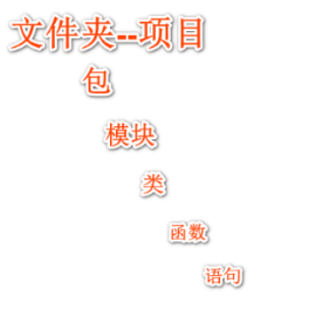

# 第一部分 Python基础 

## 第一讲 Python历史及环境搭建

###  1.Python语言的介绍

​	Python语言是一种面向对象的、解释型的、动态数据类型的高级程序设计语言，具有简洁的语法规 则，使得学习程序设计更容易，同时具有强大的功能，能满足大多数应用领域的开发需求。

   1989年圣诞节期间，在阿姆斯特丹，荷兰人Gudio van Rossum为了打发时间，决心开发一个新的 解释程序，作为ABC语言的一种继承。ABC是由Gudio参加设计的一种教学语言，就Gudio本人看来， ABC语言非常优美和强大，是专门为非专业程序员设计的。但是ABC语言并没有成功，究其原因， Gudio认为是非开放造成的。Gudio决心在Python中避免这一错误，同时，他还想实现在ABC中闪现过 但未曾实现的东西。之所以选Python（蟒蛇）作为语言的名字，是因为他是电视剧Monty Python’s Flying Circus的爱好者。就这样，Python在Gudio van Rossum手中诞生了。


​	Python崇尚优美、清晰、简单，是一个优秀并广泛使用的语言。由于Python语言的简洁性、易读 性以及可扩展性，在国外用Python做科学计算的研究机构日益增多，一些知名大学已经采用Python来教 授程序设计课程。例如卡内基梅隆大学的编程基础、麻省理工学院的计算机科学及编程导论就使用 Python语言讲授。众多开源的科学计算软件包都提供了Python的调用接口。

   1991年，第一个Python解释器诞生，它是用C语言实现的，并能够调用C语言的库文件。 1994年，Python 1.0版本发布。2000年，Python 2.0版本发布，加入了内存回收机制，构成了现在Python语言框架的基础。 2008年，Python 3.0版本发布，解决和修正以前语言版本的内在设计缺陷，不向下兼容。 2010年，Python 2.7版本发布，这是Python 2.X的最后一个版本。 2018年，Python宣布Python 2.7版本于2020年1月1日终止支持。 2020年，Python 3.9版本发布。 自 2018 年起，教育部考试中心在全国计算机等级考试（NCRE）加入了二级“Python 语言程序设 计”科目。在人工智能时代的今天，Python得到了广泛的应用，从TIOBE编程语言排行榜近几年的趋势图 上，可以感受到Python使用率急剧上升，截止到2021年10月，Python已经称为世界上最受欢迎的编程语言。


### 2.Python语言的特点：

   1）简单易学：相比其他编程语言（比如 Java），Python代码非常简单，上手非常容易。比如我们 要完成某个功能，若用Java需要100行代码，但用Python可能只需要20行代码，这是Python具有巨大吸 引力的一大特点。

   2）免费开源：Python的使用和分发是完全免费的，开发者可以从互联网上免费获得Python的源代 码。复制Python，将其嵌入你的系统或者随产品一起发布都没有任何限制。Python的社区也很发达，即 使一些小众的应用场景，Python往往也有对应的开源模块来提供解决方案。 

  3）面向对象：Python是一门面向对象编程的语言，它的类模块支持多态、操作符重载和多重继承 等高级概念，并且以Python特有的简洁的语法和类型，面向对象十分易于使用。除了作为一种强大的代 码构建和重用手段以外，Python的面向对象特性使它成为面向对象语言（如C++和Java）的理想脚本工 具。例如，通过适当地粘贴代码，Python程序可以对C++、Java和C#的类进行子类的定制。 

  4）丰富的库：Python具有脚本语言中最丰富和强大的类库，这些类库被形象地称为“内置电池” （batteries included），这些类库覆盖了文件 I/O、GUI、网络编程、数据库访问、文本操作等绝大部 分应用场景。

   5）可扩展性：Python本身被设计为可扩充的，并非所有的特性和功能都集成到语言核心。Python 提供了丰富的API和工具，以便程序员能够轻松地使用C语言、C++、Cython来编写扩充模块。Python解 释器本身也可以被集成到其它需要脚本语言的程序内。因此，很多人还把Python作为一种“胶水语言 “（glue language）使用，使用Python将其他语言编写的程序进行集成和封装。

### 3.Python的应用领域 

   1）常规软件开发：Python支持函数式编程和面向对象编程，能够承担任何种类软件的开发工作， 因此常规的软件开发、脚本编写、网络编程等都属于标配能力。

   2）科学计算：随着NumPy、SciPy、Matplotlib等众多程序库的开发，Python越来越适合于做科学 计算、绘制高质量的2D和3D图像，NASA就大量使用Python进行各种复杂的科学运算。 

  3）自动化运维：在很多操作系统里，Python是标准的系统组件。作为运维工程师首选的编程语 言，Python在自动化运维方面已经深入人心，比如Saltstack和Ansible都是大名鼎鼎的自动化平台。

   4）云计算：Python是从事云计算工作需要掌握的一门编程语言，开源云计算解决方案OpenStack 就是基于Python开发的。

   5）WEB开发：基于Python的Web开发框架非常多，比如耳熟能详的Django，还有Tornado、 Flask等。其中的Python+Django架构，应用范围非常广，开发速度非常快，学习门槛也很低，能够帮助 你快速的搭建起可用的WEB服务。 

  6）网络爬虫：在爬虫领域Python几乎是霸主地位，Python可以将网络一切数据作为资源，通过自 动化程序进行有针对性的数据采集以及处理，scrapy等爬虫框架应用非常广泛。

   7）数据分析：在大量数据的基础上，结合科学计算、机器学习等技术，对数据进行清洗、去重、 规格化和针对性的分析是大数据行业的基石。Python是数据分析的主流语言之一。

   8）人工智能：Python在人工智能大范畴领域内的机器学习、神经网络、深度学习等方面都是主流 的编程语言，得到广泛的支持和应用。

### 4.Python环境配置 

  “工欲善其事，必先利其器”，要学习Python程序设计，首先得在计算机上搭建Python开发环境，以 下我们以常见的Windows操作系统为例。

   程序设计语言的源代码是文本格式，这意味着我们甚至可以使用“记事本”程序编写Python代码。但 要让计算机执行Python代码，就必须通过Python解释器来完成。

  Python语言的官网是www.python.org，在上面我们可以下载适配各种操作系统不同版本的Python 解释器。 从https://www.python.org/downloads/windows/页面，我们选择64位的3.10.1版本，点击下 载。 

   完成下载后，双击下载的文件python-3.10.1-amd64.exe，启动安装程序。


进入Optional Features选择页面，直接点击“Next”按钮即可，在高级Optional中选择为所有用户安装，并指定Python安装目录。


  安装完成后，点击"Close"按钮结束安装程序。安装了Python的解释器后，我们可以在当前系统中Windows+R键输入cmd，再输入命令python，当看到当前Python安装版本后，就表示已经安装成功。


​	 “>>>”是Python提示符，在此输入python语句，回车就会执行并显示结果。 来编写我们的第一个 Python程序，经典程序语言入门程序Hello World。

```
print("Hello World")
```


## 第二讲 Python环境搭建_IDE工具使用

实际开发中，除了编译器是必须的工具，我们往往还需要很多其他辅助软件，例如：

- 编辑器：用来编写代码，并且给代码着色，以方便阅读；
- 代码提示器：输入部分代码，即可提示全部代码，加速代码的编写过程；
- 调试器：观察程序的每一个运行步骤，发现程序的逻辑错误；
- 项目管理工具：对程序涉及到的所有资源进行管理，包括源文件、图片、视频、第三方库等；
- 漂亮的界面：各种按钮、面板、菜单、窗口等控件整齐排布，操作更方便。

  这些工具通常被打包在一起，统一发布和安装，例如 Pycharm、Visual Studio、Dev [C++](http://c.biancheng.net/cplus/)、Xcode、Visual C++ 6.0、C-Free等，它们统称为集成开发环境（IDE，Integrated Development Environment）。
  这里我们以现在最流行的jetbrains公司的Pycharm为例进行安装使用。Pycharm的官方下载地址为：https://www.jetbrains.com/pycharm/download。官方网站提供两个版本下载：专业版和社区版。专业版只提供30天的试用，30天后需要花钱激活，以便终身使用；社区版永久免费，它的功能足够让您在Python基础阶段使用。所以您可以根据您不同的学习阶段来选择适合您的版本。


​	下载后，点击".exe"文件运行进入安装步骤。首先需要在"Choose Install Location"中选择安装路径，点击"Next"进入下一步。


​	在"Installation Options"中，您可以直接使用默认的选项，然后点击"Next"进入下一步，当然您也可以参照如下选项，以方便在开发中的使用。


​	最后点击"Install"安装即可。当您第一次打开Pycharm，首先进入的是一个欢迎界面：Welcome to Pycharm，其界面如下：


- New Project：快速创建一个项目
- Open：打开本地已有的项目
- Get From VCS：通过版本控制工具（Git/SVN等）拉取远程的项目（GitHub/GitLab/码云等）

  您可以设置每次进入Pycharm时都进入欢迎界面，设置步骤为： File | Settings | Appearance & Behavior | System Settings：


​	我们点击"New Project"创建一个新的项目，选择"Pure Python"创建一个Python项目，指定Python的运行版本：


​	创建好后点击项目名pythonProject，鼠标右键New | Python File，创建一个名为"01-first"的Python文件，并在右侧代码编辑区编写代码：

```python
print("Hello World!")
```

​	编辑好后，鼠标右键选择"Run 01-first"或使用快捷键Ctrl+Shift+F10，运行该Python文件，运行后在控制台将看到输出的内容"Hello World!"。


主菜单栏各选项的作用：

- File：文件/项目操作，File | Settings （重点）。
- Edit：编辑，最常用的是Find选项，在文件内或者项目内进行查找/替换。
- View：视图，常用的是Tool Windows（ 工具窗口），Appearance（外观设置），Compare With（比较文件差异）。
- Navigate：导航。
- Code：编码，自动补全，格式换代码，使用if/while/for/try..catch条件语句包裹目标代码等。
- Refactor：重构。
- Run：运行和调试，配置运行环境等。
- Tools：工具。
- VCS：版本控制（重点）。
- Windows：窗体。
- Help：帮助相关，常用的有“Find Action”查看快捷键，“?Help”查看官网文档，“Tip of the Day”每日小技巧，“Check for Update”检查更新，“About”查看pycharm版本。

## 第三讲 变量及数据类型

### 1.Python语法

  Python 官方推荐的 PEP-8 代码风格详细说明：https://www.python.org/dev/peps/pep-0008/。我们通过Python官网首页上输出斐波那契数的样例程序来认识Python的基本语法元素：

```python
# Python 3: Fibonacci series up to n
def fib(n):    
    a, b = 0, 1    
    while a < n:        
        print(a, end=' ')        
        a, b = b, a+b    
        print()
        
        
fib(1000)

---- 以下是运行结果 ----
0 1 1 2 3 5 8 13 21 34 55 89 144 233 377 610 987` 
```


#### 1.1.缩进

   Python默认从程序的第一条语句开始，按顺序依次执行各条语句。代码块可视为复合语句。在C、 Java等语言中，用大括号“{}”表示代码块。Python使用缩进（空格）来表示代码块，连续的多条具有相 同缩进量的语句为一个代码块。通常，语句末尾的冒号表示代码块的开始，例如if、for、while、def、 class等语句都会使用到代码块。上边案例的4、5、8行是同一个代码块，6、7行又是其中嵌套的代码 块。
   严格的缩进可以约束程序结构，有利于维护代码结构的可读性。应注意同一个代码块中的语句，其 缩进量应保持相同，否则会报错。下边代码第7行的缩进少了一个空格，运行时会弹出错误警告并定位到 该行，如图所示。

```python
# Python 3: Fibonacci series up to n
def fib(n):
a, b = 0, 1
while a < n:
print(a, end=' ')
a, b = b, a+b
print()
fib(1000)
```


####  1.2.注释 

  注释是程序员在代码中加入的一行或多行说明文字，可以提升代码的可读性。注释是辅助性文字， Python解释器会忽略过去，不予执行。例如，上边实例代码的第1行就是一个注释。

   Python注释分单行注释和多行注释。单行注释以符号“#”开始，当前行中符号“#”及其后的内容为注 释。单行注释可以单独占一行，也可放在语句末尾。多行注释是用3个英文的单引号“'''”或3个双引号“"""” 作为注释的开始和结束符号。下列三个程序的直接结果都是一样的。

```python
# 这是单行注释

print('Hello, World!')  # 这也是单行注释 

# ---- 运行结果 ---- 
# Hello, World!
```


```python
''' 
    这是多行注释 
    前后各使用3个单引号 
''' 
print('Hello, World!') 
---- 运行结果 ---- 
Hello, World!
```


```python
""" 
    这是多行注释 前后各使用3个双引号 
""" 
print('Hello, World!') 
---- 运行结果 ---- 
Hello, World!
```

要注意 多行注释的3个单引号或双引号要成对使用，不能3个单引号和3个双引号混搭。如下图，会 弹出字符错误警告：


​	注释主要有3个用途。第一，标明作者和版权信息。在每个源代码文件开始前增加注释，标记编写 代码的作者、日期、用途、版权声明等信息，可以采用单行或多行注释。第二，解释代码原理或用途。 在程序关键代码附近增加注释，解释关键代码作用，增加程序的可读性。由于程序本身已经表达了功能 意图，为了不影响程序阅读连贯性，程序中的注释一般采用单行注释，标记在关键代码同行。对于一段 关键代码，可以在其附近采用一个多行注释或多个单行注释给出代码设计原理等信息。第三，辅助程序 调试。在调试程序时，可以通过单行或多行注释临时“去掉”一行或连续多行与当前调试无关的代码，辅 助程序员找到程序发生问题的可能位置。

#### 1.3.保留字和关键字 

   保留字即关键字，是 Python 语言中一些已经被赋予特定意义的单词，这就要求开发者在开发程序 时，不能用这些保留字作为标识符给变量、函数、类、模板以及其他对象命名。 

  在Python环境中，可以用help('keywords')列出所有的保留字：


​	保留字大小写敏感，如and是保留字，但And或AND等则不是，可以定义为变量使用。当然，我们 不建议这样做，以避免混淆。如下，试图定义and变量并赋值会引发错误。


### 2.变量

   变量就是值可以改变的量。要操作变量就必须使用标识符给它们命名并通过这个名字访问其代表的 数据。在Python中，变量可以存储各种形式的数据。 

  变量在使用前需要创建，Python通过赋值来创建变量。在程序中，使用等号来给变量赋值，等号左 侧是变量名，等号右侧是存储在变量中的值。如：

```python
name = '李明' 

    

赋值操作通过等号（赋值符号）实现，其目的是将等号右侧的值和等号左侧的变量名进行关联。如
果等号左侧的变量尚未创建，就会创建该变量并对其赋初值；如果等号左侧的变量已经存在，就会用等
号右侧的值更新等号左侧变量的原值。
在Python中，可以一次性给多个变量赋值，代码显得更简洁。如求斐波那契数列样例程序的a, b =
0, 1等同于：
a = 0b = 1


    
```

而a, b = b, a+b等同于

```python
temp = a
a = b
b = b + temp
```

另外，给多个变量赋相同的值还可以写成如a = b = c = 1的形式。


### 3.基础数据类型

   计算机能够处理各种各样的数据，不同的数据需要定义不同的数据类型，不同的数据类型有不同的 运算规则和处理方式。

#### 3.1.整型 

   整型（int）是表述整数的数值，没有小数部分，整数包括正整数、负整数和0。只要计算机内存空 间足够，Python可以处理任意大小的整数，如求99的99次方：


​	 一般的整数常量都是十进制的。计算机由于使用二进制，所以Python还允许将整数常量表示为二进 制、八进制和十六进制。 

  二进制：以“0b”或“0B”开头，后面跟二进制数字（0或1）。例如0b1001、0B1111。

   八进制：以“0o”或“0O”开头，后面跟八进制数字（0~7）。例如0o123、0O107。 

  十六进制：以“0x”或“0X”开头，后面跟十六进制数字（0~9、A~F或a~f）。例如0x12AB、0X12ab。 

  不同进制只是整数的不同书写形式，程序运行时会将整数处理为十进制数。对于很大的数，例如 10000000000，很难数清楚0的个数。Python允许在数字中间以_分隔，因此，写成10_000_000_000和 10000000000是完全一样的。十六进制数也可以写成0xa1b2_c3d4。

#### 3.2.浮点型 

   浮点型（float）由整数部分与小数部分组成，浮点数还可以通过科学计数法表示，1.5、2.0、.5、 1.、1.234e+2、1.234E-5等都是合法的浮点数常量，1.234E-5即0.00001234。 整数和浮点数在计算机内部存储的方式是不同的，整数运算永远是精确的，而浮点数运算则可能会 有四舍五入的误差。如：


与整数不同，浮点数存在取值范围，范围为-10^308^~10^308^，超过取值范围会产生溢出错误 （OverflowError）。如：


#### 3.3.布尔型

   布尔型（bool）也称逻辑常量，只有True和False两个值，用来表示逻辑运算的结果。如：

```python
>>> 3 > 2

True

>>> 3 < 2

False

>>>
```

####   3.4.复数 

   Python支持数学上的复数，复数（complex）由实数部分和虚数部分构成，可以用“实部+虚部j”、 “实部+虚部J”或者complex(实部,虚部)表示，复数的实部和虚部都是浮点型。如：

```python
>>> (2+3J)+complex(2,3) 
(4+6j)
 >>> (2+3j)*complex(2,3) 
(-5+12j)
```


#### 3.5.字符串 

  字符串（string）是字符的序列，用于存储文本数据类型。Python主要有三种方法来表示字符串。

  单引号：a = 'Hello, '。 

  双引号：b = "World!"。 三个单引号或双引号： '''Hello, World!'''、"""Hello, World!"""，三引号字符串可以包含多行字符。

   在计算机中，字符串是以字符为单位从左到右顺序存储的，每个字符都有固定的位置，称为字符串 的一个元素，可以通过下标来访问字符元素。注意下标是从0开始计数的。还可以用负数下标访问数组元 素，[-1]表示最后一个元素，[-2]表示倒数第二个元素，以此类推。如：

```python
>>> b = "World!" 
>>> b[0] 
'W'
 >>> b[3] 
'l' 
>>> b[-1]
 '!' 
>>> b[-3] 
'l'
```


注意：字符串声明后就不能改变。试图修改字符串中的字符元素会导致错误，如：

```python
>>> b = "World!" 
>>> b[3] = "a" 
Traceback (most recent call last): 
    File "<pyshell#29>", line 1, in <module> 
        b[3] = "a" 
TypeError: 'str' object does not support item assignment 


 
```


#### 3.6.数据类型的转换

   Python支持多种数据类型，每一个数据都是一个对象，而变量就是在程序中用来指向这些数据对象 的，对变量赋值就是把数据和变量给关联起来，可以用type()函数查看数据或变量的数据类型，如：

```python
>>> a, b, c, d, e = 123, 1.23, True, 2+3j, 'python' 
>>> print(type(a),type(b),type(c),type(d),type(e)) 
<class 'int'> <class 'float'> <class 'bool'> <class 'complex'> <class 'str'>
```


可以使用和类型名相同的函数将数据转换为指定的数据类型，如：

```python
>>> int(12.3) 
12
>>> float('12.3') 
12.3 
>>> bool(1) 
True 
>>> complex(4)
 (4+0j) 
>>> str(12.3) 
'12.3'
```


## 第四讲 if条件判断（上）

计算机的控制程序有三种：顺序结构、分支结构和循环结构，这三种控制结构是组成更复杂程序的基础。

### 1.程序的基本结构

   1965年，E. W. Dijikstra提出了结构化程序设计方法，是软件发展的一个重要的里程碑。它的主要 观点是采用自顶向下、逐步求精及模块化的程序设计方法。结构化程序设计主要强调的是程序的易读 性。 

  自顶向下：程序设计时，应先考虑总体，后考虑细节；先考虑全局目标，后考虑局部目标。不要一 开始就过多追求众多的细节，先从最上层总目标开始设计，逐步使问题具体化。

   逐步求精：对复杂问题，应设计一些子目标作为过渡，逐步细化。 模块化设计：一个复杂问题，肯定是由若干稍简单的问题构成。

  模块化是把程序要解决的总目标分 解为子目标，再进一步分解为具体的小目标，把每一个小目标称为一个模块。

   按照结构化程序设计的观点，任何算法功能都可以通过由程序模块组成的三种基本程序结构的组 合：顺序结构、分支结构和循环结构来实现。这样写出来的程序结构清晰、容易理解、容易修改、容易 验证。


### 2.分支结构

   分支结构指程序根据条件执行不同的代码块。作为控制结构的核心，分支结构在我们生活中无处不 在。如：

​     1）如果下雨，我们就要打伞。 

​     2）如果账号密码正确，就可以正常登录系统，否则就会报错。

​     3）根据年龄的不同，我们分别是儿童、少年、青年、中年、老年。

   这些例子都属于分支结构，在使用分支结构的时候还可以分为4种形式，分别是if语句、if...else语 句、if...elif...else多分支语句以及分支结构的嵌套 。

#### 2.1单分支结构：if语句

   单分支if语句的基本结构如下：

```python
if 条件表达式: 
    语句块
```

​	条件表达式可以是一个变量或者布尔值，也可以是比较表达式或逻辑表达式，如果表达式的结果为 True就会执行语句块中的代码，如果为False就跳出此判断往下继续运行。单分支if语句的执行流程如下 图所示：


示例：求绝对值

```python
''' 
    从键盘上输入任意一个整数，然后输出它的绝对值！ Input 从键盘上输入任意一个整数。 Output 输出它的绝对值。
 ''' 
n = eval(input())
 if n<0: 
    n = -n 
print(n)
```


####  2.2.双分支结构：if...else语句

  当我们面临两种选择的时候就要使用到if...else结构，它的格式为：

```python
if 条件表达式: 
    语句块1 
else：
    语句块2
```

  当条件表达式计算结果为True时，执行语句块1中的代码；否则，执行语句块2中的代码。双分支if 语句的执行流程如下图所示：


示例：求两个整数之中较大者

```python
''' 
    输入两个整数，请编程求其中的较大者。 
    Input 
    在一行中输入用空格隔开的两个整数，
    例如5 9。 Output 输出两个整数之中较大者，输出形式举例：max=9。
 ''' 
get_input = input().split() 
a = eval(get_input[0]) 
b = eval(get_input[1]) 
if a>b: 
    print('max={:d}'.format(a)) 
else:
    print('max={:d}'.format(b)) 
```


## 第五讲 if条件判断（下）

### 1.多分支结构：if...elif...else语句

   对于一个问题处于多种选择的状态下，也可以理解为判断条件有多个值的时候，if...else就不能满足 我们的需求，这时候我们就要借助elif来解决问题。elif是等同于else+if，它的使用可以帮助我们简化代 码，不至于要使用过多的if...else语句。多分支if语句的基本结构如下：

```python
if 条件表达式1: 
    语句块1 
elif 条件表达式2: 
    语句块2 ……
elif 条件表达式n: 
    语句块n 
else:
    语句块n+1
```

多分支if语句的else部分可以省略。执行流程如下图：


### 2.分支结构的嵌套

  前面详细介绍了3种形式的条件语句，即 if、if…else和if…elif…else，这3种条件语句之间可以相互 嵌套。例如，在最简单的if语句中嵌套if else语句，形式如下：

```python
if 条件表达式1： 
    if 条件表达式2： 
        语句块1 
    else：
        语句块2
```


再比如，在if…else语句中嵌套if……else语句，形式如下：

```python
if 条件表达式1：
     if 条件表达式2： 
            语句块1 
    else：
            语句块2 
else：
    if 条件表达式3： 
            语句块3 
    else：
            语句块4
```

  Python中，if、if…else和if…elif…else之间可以相互嵌套。因此，在编写程序时，可以根据需要，选 择合适的嵌套方案。要注意的是，在相互嵌套时，一定要严格遵守不同级别代码块的缩进规范。 

### 3.if...else三元表达式

  if…else三元表达式是简化版的if…else语句，其基本格式如下： 

```python
表达式1 if 条件表达式 else 表达式2 
```

  当条件表达式计算结果为True时，将表达式1的值作为三元表达式的结果；否则，将表达式2的值作 为三元表达式的结果。


## 第六讲 while循环

### 1.循环结构

  很多时候，我们需要反复执行某段代码，像前面讨论OJ平台数据输入输出问题时，需要反复读取数 据进行相应处理，这时候就需要使用循环结构，而不会是把这段代码写上若干遍。 

  对于循环结构，主要分为两种类型： 

​    1）条件控制的循环：条件控制的循环采用一个条件表达式来控制循环的次数，Python提供while语 句来编写条件控制的循环。 

​    2）计数控制的循环：计数控制的循环是根据指定的次数来进行循环，Python提供for语句来编写计 数控制的循环。


### 2.条件循环

  while循环和if条件分支语句类似，即在条件（表达式）为真的情况下，会执行相应的代码块。不同 之处在于，只要条件为真，while 就会一直重复执行那段代码块。while 语句的语法格式如下：

```python
while 条件表达式: 
        代码块
```

   这里的代码块，指的是缩进格式相同的多行代码，不过在循环结构中，它又称为循环体。 

  while语句执行的具体流程为：首先判断条件表达式的值，其值为True时，则执行代码块中的语 句，当执行完毕后，再回过头来重新判断条件表达式的值是否为True，若仍为True，则继续重新执行代 码块...如此循环，直到条件表达式的值为False才终止循环。while语句循环的执行流程如下图所示：


​	如果条件表达式始终为True，则构造无限循环——也称“死循环”。因此在循环体中通常会对条件表 达式的变量进行修改，控制条件表达式取值适时为False，从而结束循环。

## 第七讲 for循环

### 1.for循环

  Python的for循环可以遍历任何可迭代对象，如遍历字符串、列表、元组、字典、集合等序列类 型，逐个获取序列中的各个元素。for语句实现遍历循环，其基本格式如下：

```python
for var in object: 
  	循环体
```

​	object是一个可迭代对象，for语句执行时，依次将object中的数据赋值给变量var--该操作称为迭 代。var每赋值一次，就执行一次循环体。for语句循环的执行流程如下图所示：


我们来看一个简单的例子：遍历字符串

```python
for ch in 'Python': 
    print(ch) 
---- 运行结果 ---- 
P
y
t
h
o
n
```

for循环会依次取出字符串中的每一个字符，赋给变量ch。循环体简单地输出，显示出字符序列。 

在循环过程中我们经常需要整数序列，可以使用range()函数来生成包含连续多个整数的range对 象，其基本格式为：

```python
range(end)
 range(start, end [,step]) 
```

只指定一个参数（end）时，生成整数范围为0 ~ end-1。

指定两个参数（start和end）时，生成整数范围为start ~ end-1。 

整数之间的差值为step，step默认为1。 

我们用for循环来解决数列求和，和前面while循环代码对比一下。  

```python
''' 
---- while循环代码 ---- 
n = int(input()) 
m = 1 
sumN = 0
while(m<=n): 
        sumN += m 
        m += 1 
print(sumN)
 '''
 n = int(input()) 
sumN = 0 
for m in range(n+1):
        sumN += m 
print(sumN)
```

可以看到，像这样确切知道循环次数的循环，用for循环更简便。Python提供了sum()求和函数，可 以对序列求和。

```python
n = int(input())
 print(sum(range(n+1))) 
```


### 2.循环结构嵌套  

  嵌套循环和if语句的嵌套原理相似，就是在一个循环内嵌套另外一个循环，例如for循环里面还有for 循环，while循环里面还有while循环，甚至while循环中有for循环或者for循环中有while循环也都是允许 的。

   当两个或多个循环结构相互嵌套时，位于外层的循环结构常简称为外层循环或外循环，位于内层的 循环结构常简称为内层循环或内循环。

示例：打印直角三角形 

```python
''' 
输入直角三角形的直角边长度(两个直角边相同)，打印输出该图形。如输入5，输出下列图形：
 *
**
*** 
**** 
***** 
Input 输入数据第一行为n，表示一共有n组数据输入，后面有n行，每行表示直角边长度(两个直角边相同)。
 Output 以*字符来打印输出直角三角形图形。
 '''
 n = int(input()) 
for _ in range(n): 
        a = int(input())
        for i in range(a): 
            for j in range(i): 
                print('*', end='') 
            print() 
```

## 第八讲 字符串

字符串（string）是字符的序列，用于存储文本数据类型。Python主要有三种方法来表示字符串：

  1）单引号：a = 'Hello, '。 

  2）双引号：b = "World!"。 

  3）三个单引号或双引号： '''Hello, World!'''、"""Hello, World!"""，三引号字符串可以包含多行字符。 

  在计算机中，字符串是以字符为单位从左到右顺序存储的，每个字符都有固定的位置，称为字符串 的一个元素，可以通过下标来访问字符元素。注意下标是从0开始计数的。还可以用负数下标访问数组元 素，[-1]表示最后一个元素，[-2]表示倒数第二个元素，以此类推。如：

```
>>> b = "World!"
 >>> b[0] 
'W' 
>>> b[3]
'l'
>>> b[-1] 
'!' 
>>> b[-3] 
'l'
```

注意：字符串声明后就不能改变。试图修改字符串中的字符元素会导致错误，如：

```
>>> b = "World!" 
>>> b[3] = "a" 
    Traceback (most recent call last): 
        File "<pyshell#29>", line 1, in <module> 
            b[3] = "a" 
TypeError: 'str' object does not support item assignment 


 
```

### 1.字符串格式化

Python的字符串可通过占位符%，format()方法，f-strings三种方式实现格式化输出。

-  **占位符%： 利用%占位符可以为真实值预留位置，并说明真实值应呈现的格式：**

```
name = 'Python'

print('你好，我叫%s' % name)
```


| 符号 | 说明                    | 符号 | 说明                  |
| ---- | ----------------------- | ---- | --------------------- |
| %s   | 字符串                  | %X   | 16进制整数（A-F大写） |
| %d   | 10进制整数              | %e   | 指数（底数为e）       |
| %o   | 8进制整数               | %f   | 浮点数                |
| %x   | 十六进制整数（a-f小写） |      |                       |

如果使用占位符和对应的变量类型不匹配会出现异常：

```
name = 'python'

age = '31'

print('我叫%s,今年%d岁了' % (name, age))

# TypeError: %d format: a real number is required, not str
```

- **format()方法： format()方法同样可以对字符串格式化输出，与占位符%不同的是，使用format()不需要关注变量的类型，其格式如下：**

```
<字符串>.format(<参数列表>)
name = 'Python'

age = 31

print('你好，我的名字是:{}，今年{}岁了'.format(name, age))
```

  如果字符串中包含多个"{}",并且{}中没有指定任何序号，那么默认按照{}出现的顺序匹配faomat()方法里的参数，如果明确指定了序号，那么按照序号对应的参数进行替换：

```
name = 'Python'

age = 31

print('你好，我的名字是:{1}，今年{0}岁了'.format(age, name)) 
```

- **f-strings: f-strings是从Python3.6开始加入的标准库内容，它提供了更简洁的方式格式化字符串，f-strings本质上不再是字符串常量，而是在运行时运算求值的表达式，所以效率更优于%和format()：**

```
address = '成都'

print(f'欢迎来到{address}')

name = '卡卡'

age = 40

gender = '男'

print(f'我最喜欢的球星{name}，他今年{age}岁，他的性别是{gender}')
```


### 2.字符串常见操作

- **字符串拼接： 字符串的拼接可以直接用"+"来实现。**

str1 = '人生苦短，'

str2 = '快用Python。'

print(str1 + str2)


-  **字符串替换**： 字符串的替换可以使用replace()方法来完成，语法格式为：

```python
str.repalce(old, new, count = None)
str3 = '我是Micheal，今年30岁了。'

str4 = str3.replace('我', '他')

print(str4)
```

如果字符串没有找到匹配的子串，会直接返回原来的字符串：

```python
str3 = '我是Micheal，今年30岁了。'
str4 = str3.replace('他', '我')
print(str4)
```

- **字符串分割**： 字符串的分割采用split()方法，语法格式为：

```python
str.split(sep = None, maxsplit = -1)
```


```python
str5 = '1 2 3 4 5'

print(str5.split())  # 默认分隔空格

str6 = 'a,b,c,d,e'

print(str6.split(','))

str7 = '人生苦短，快用Python'

print(str7.split('苦'))
```


- **取出字符串两端的空格**： 用strip()方法来去除祖父穿两侧的空格，语法格式为：

```python
str.strip(chars = None)
```


```python
str8 = ' 你好 '

print(str8.strip())

str9 = '%%hello%%'

print(str9.strip('%'))
```


### 3.字符串的索引和切片

- **索引**： 字符串的所以可以通过正向和逆向两种方式进行索引，正向索引从0开始索引值依次加1，逆向索引从-1开始索引值依次减1：


通过字符串的索引值可以获取指定的字符：

```python
str1 = 'Python'

print(str1[0])

print(str1[-2])
```

需要注意的是，索引值不能越界，否则会报越界异常。

- **切片： 切片用于截取目标对象中的一部分，其语法格式为：**

```python
[起始:结束:步长]
```

切片的默认步长为1，需要注意的是切片获取的区间属于左闭右开型，即包含起始位，但不包含结束位。

```python
str1 = 'Python'

print(str1[0:4:1])

print(str1[0:4:2]) 
```


## 第九讲 列表_元组

### 1.列表

  列表是Python最常用的数据类型，因为Python的列表十分强大，很多操作都是基于列表来进行 的。列表是一个有序序列，可以包含任意类型的对象：数字、字符串、列表、元组或其他对象。列表常 量用方括号表示，例如：

```python
>>> type([1, 2, 3, 'abc']) 
<class 'list'>
```

列表是可变的。列表的长度可变，即可添加或删除列表成员。列表元素的值也可改变。Python中内 置了很多函数或方法来操作列表，主要包括索引、分片、列表操作符加和乘，以及其他一些函数和方 法，如计算列表长度、最大值、最小值等函数以及添加、修改或删除列表元素的方法等。 


#### 1.1.列表的创建和删除

  列表的创建是用方括号括起所有元素，并且元素之间用逗号分隔。若使用一对空的方括号，创建的 是一个空的列表。list()函数可以用来生成列表。

```python
>>> [1, 2, 3, 'abc'] 
[1, 2, 3, 'abc'] 
>>> [] 
[]
>>> list() 
[]
>>> list('abcd') 
['a', 'b', 'c', 'd'] 
>>> list(range(5)) 
[0, 1, 2, 3, 4] 


 
```

列表的删除采用del语句来操作。

```python
>>> list1 = [1, 2, 3] 
>>> print(list1) 
[1, 2, 3] 
>>> del list1 
>>> print(list1) 
Traceback (most recent call last): 
File "<pyshell>", line 1, in <module> 
NameError: name 'list1' is not defined
```

最后的出错信息表明列表已经被删除了。 


#### 1.2.列表的索引

与字符串的索引一样，列表索引从0开始，第二个索引是1，依此类推。通过索引列表可以进行截 取、组合等操作。


```python
list = ['red', 'green', 'blue', 'yellow', 'white', 'black'] 
print( list[0] ) 
print( list[1] ) 
print( list[2] ) 
---- 运行结果 ---- 
red 
green 
blue
```

索引也可以从尾部开始，最后一个元素的索引为-1，往前一位为-2，以此类推。


```python
list = ['red', 'green', 'blue', 'yellow', 'white', 'black'] 
print( list[-1] ) 
print( list[-2] ) 
print( list[-3] ) 
---- 运行结果 ---- 
black 
white 
yellow
```

#### 1.3.列表的基本操作 

我们通过下表了解列表的基本操作（每次操作前设 a = [1, 3, 2]，b = [4, 5]）

| **操作**     | **格式**             | **说明**                                                     | **例子**                                   |
| ------------ | -------------------- | ------------------------------------------------------------ | ------------------------------------------ |
| 读取元素     | list[index]          | 通过索引下标读取元素                                         | a[1]，返回3                                |
| 切片         | list[index1:index2]  | 读取从下标index1到下标index2-1的多个元 素，返回一个新的列表。list[:]返回所有。索 引值以0为开始值，-1为从末尾的开始位置。 正数从前面索引，负数从后面索引。 | a[1:3]，返回 [3,2]； a[-3:-1]，返回 [1, 3] |
| 追加元素     | list.append(x)       | 将元素x追加到列表list的尾部                                  | a.append(4)， a为[1, 3, 2, 4]              |
| 插入元素     | list.insert(index,x) | 将元素x插入到列表list下标index位置                           | a.insert(2,4)，  a为[1, 3, 4, 2]           |
| 追加列表     | list.extend(list1)   | 将列表list1中各元素依次添加到列表list的尾 部                 | a.extend(b)， a为[1, 3, 2, 4, 5]           |
| 删除末尾元素 | list.pop()           | 删除列表list尾部元素，返回被删除的元素                       | a.pop()， 返回2，a为[1,3]                  |
| 删除指定元素 | list.remove(x)       | 删除列表list中第一个值为x的元素，如果找不 到x则报错          | a.remove(3)， a为[1, 2]                    |
| 修改元素     | list[index]=x        | 将列表list下标index所在元素重新赋值为x                       | a[2]=4， a为 [1,3,4]                       |
| 查找元素     | x in list            | 如果列表list存在x，则返回True，否则返回 False                | 1 in a， 返回 True                         |

| **操作**         | **格式**       | **说明**                                                  | **例子**                   |
| ---------------- | -------------- | --------------------------------------------------------- | -------------------------- |
| 查找元素下标     | list.index(x)  | 如果列表list存在x，则返回x的下标，否则报 错               | a.index(3)，返 回1         |
| 计算元素次数     | list.count(x)  | 计算元素x在列表list中出现的次数，如果没有 出现则返回0     | a.count(2)， 返回1         |
| 排序             | list.sort()    | 对列表list中的各个元素进行排序                            | a.sort()，a为 [1,2,3]      |
| 反转             | list.reverse() | 将列表list的所有元素逆序                                  | a.reverse()，a 为[2, 3, 1] |
| 复制列表         | list.copy()    | 复制列表list，返回复制后的新列表                          | a.copy()，返回 [1,3, 2]    |
| 清空列表         | list.clear()   | 删除列表list所有元素，list变为空列表                      | a.clear()，a为[ ]          |
| 连接两个列表     | list1+list2    | 将列表list2中各元素依次添加到列表list1尾 部，返回新的列表 | a+b，返回 [1,3,2,4, 5]     |
| 重复列表元素     | list*n         | 将列表list的所有元素重复n遍，返回新的列表                 | a*2，返回 [1,3,2,1, 3, 2]  |
| 列表长度         | len(list)      | 返回列表list的长度，即列表中元素个数                      | len(a)，返回3              |
| 列表元素最大值   | max(list)      | 返回列表list所有元素的最大值                              | max(a)，返回 3             |
| 列表元素的最小值 | min(list)      | 返回列表list所有元素的最小值                              | min(a)，返回1              |
| 列表元素和       | sum(list)      | 返回列表list所有元素的和                                  | sum(a)，返回 6             |

### 2.元组

  元组（tuple）是 Python中另一个重要的序列结构，和列表类似，元组也是由一系列按特定顺序排 序的元素组成。 

  元组和列表（list）的不同之处在于：列表的元素是可以更改的，包括修改元素值，删除和插入元 素，所以列表是可变序列；而元组一旦被创建，它的元素就不可更改了，所以元组是不可变序列。

  元组也可以看做是不可变的列表，它具有列表的大多数特点。通常情况下，元组用于保存无需修改 的内容。 

  元组常量用圆括号表示，例如：

```python
>>> type((1, 2, 3, 'abc')) 
<class 'tuple'>
```


#### 2.1.元组的创建和删除 

  元组的创建是用圆括号括起所有元素，并且元素之间用逗号分隔。若使用一对空的圆括号，创建的 是一个空的元组。tuple()函数可以用来生成元组。

```python
>>> (1, 2, 3, 'abc') 
(1, 2, 3, 'abc') 
>>> () 
()
>>> tuple() 
()
>>> tuple('abcd') 
('a', 'b', 'c', 'd') 
>>> tuple(range(5)) 
(0, 1, 2, 3, 4) 


 
```

  可以看到，元组的创建方式和列表类似。但要注意，创建只有一个元素的元组时，元素后边要带一 个逗号，以区别于括号运算符。

```python
>>> (1) 
1
>>> (1,) 
(1,) 
>>> type((1)) 
<class 'int'> 
>>> type((1,)) 
<class 'tuple'>


 
```

其实创建元组时，圆括号并不是必须的，只要将各元素用逗号隔开，Python就会将其视为元组。

```python
>>> 1,2,3 
(1, 2, 3) 
>>> a = 'abc','xyz' 
>>> a ('abc', 'xyz') 
>>>
```

元组的删除也可以采用del语句来操作。

```python
>>> tuple1 = 1,2,3 
>>> print(tuple1) 
(1, 2, 3) 
>>> del tuple1 
>>> print(tuple1) 
Traceback (most recent call last): 
    File "<pyshell>", line 1, in <module> 
NameError: name 'tuple1' is not defined
```

  最后的出错信息表明元组已经被删除了。Python自带垃圾回收功能，会自动销毁不用的对象，所以 一般不需要通过del来手动删除。


#### 2.2.元组的基本操作

  元组的操作和列表类似，只是因为元组创建后不能改变，所有没有添加、删除、修改元素等操作。 我们通过下表了解元组的基本操作（每次操作前设 a = (1, 3, 2)，b = (4, 5)） 。

| 操**作**        | **格式**             | **说明**                                                     | **例子**                    |
| --------------- | -------------------- | ------------------------------------------------------------ | --------------------------- |
| 读取元素        | tuple[index]         | 通过索引下标读取指定元素                                     | a[1]，返回3                 |
| 切片            | tuple[index1:index2] | 读取从下标index1到下标index2-1的多 个元素，返回一个新的元组。同列表。 | a[1:3]，返回 (3, 2)         |
| 查找元素        | x in tuple           | 如果元组tuple存在x，则返回True，否 则返回False               | 1 in a，返回 True           |
| 查找元素下标    | tuple.index(x)       | 如果元组tuple存在x，则返回x的下标， 否则报错                 | a.index(3)， 返回1          |
| 计算元素次数    | tuple.count(x)       | 计算元素e在元组Tuple中出现的次数， 如果没有出现则返回0       | a.count(2)， 返回1          |
| 连接两个元组    | tuple1+tuple2        | 将元组tuple2中各元素依次添加到元组 tuple1尾部，返回新的元组  | a+b，返回 (1,3, 2, 4, 5)    |
| 重复元组元素    | tuple*n              | 将元组Tuple的所有元素重复n遍，返回 新的元组                  | a*2，返回 (1,3, 2, 1, 3, 2) |
| 元组长度        | len(tuple)           | 返回元组Tuple的长度，即元组中元素个 数                       | len(a)，返回3               |
| 元组元素最大 值 | max(tuple)           | 返回元组tuple所有元素的最大值                                | max(a)，返回3               |
| 元组元素最小值  | min(tuple)           | 返回元组tuple所有元素的最小值                                | min(a)，返 回1              |
| 元组元素和      | sum(tuple)           | 返回元组tuple所有元素的和                                    | sum(a)，返回6               |


#### 2.3.关于元组的不可变

我们说元组是不可变序列，创建后不能改变，如试图修改元组的元素会报错。

```python
>>> t = (1, 2, 3) 
>>> t[1] = 3 
Traceback (most recent call last): 
    File "<pyshell>", line 1, in <module> 
TypeError: 'tuple' object does not support item assignment 


 
```

那如下的操作算不算改变了元组呢？

```python
>>> t = (1, 2, 3) 
>>> print(t) 
(1, 2, 3) 
>>> t = (1, 3, 3) 
>>> print(t)
(1, 3, 3)
```

  表面上看，重新赋值后t有了新的内容，但这其实是个新的元组对象(1, 3, 3)，原来的元组对象(1, 2, 3)还在，只是变量t不再指向它。Python提供id()函数用于查看对象的内存地址，我们来看看变量t前后的 指向。 

```python
>>> t = (1, 2, 3) 
>>> id(t) 
50137208 
>>> t = (1, 3, 3) 
>>> id(t) 
50137288
```

可以看到，重新赋值的元组t，绑定到新的对象了，不是修改了原来的对象。 那下边这段操作又该怎么解释？ 

```python
>>> t = (1, 2, [3, 4]) 
>>> id(t) 
50137608 
>>> print(t) 
(1, 2, [3, 4]) 
>>> t[2][0] = 1 
>>> t[2][1] = 2 
>>> print(t) 
(1, 2, [1, 2]) 
>>> id(t) 
50137608 
 
```

  从id()函数两次的返回值不变可以看出，t所指向的元组对象还是同一个，但它的内容好像变了呀！ 其实变的不是元组的元素，而是列表的元素。元组的第3个元素，指向一个列表，就不能改成指向其他对 象，但指向的这个列表本身是可变的！理解了“指向不变”后，要创建一个内容也不变的元组怎么做？那 就必须保证元组的每一个元素本身也是不可变的。 

  元组相对于列表缺少了一些功能，但元组也有它的独特之处，首先元组的性能是比较高的，处理元 组的速率要快于列表，其次是使用元组能保障你的数据不会被修改，确保了安全性，在存储方面是一个 很好的选择。


## 第十讲 集合_字典

### 1.集合

  Python中的集合，和数学中的集合概念一样，它也是用来保存不重复的元素，即集合中的元素都是 唯一的，不会重复出现。从形式上看，Python集合和字典类似，所有元素都放在一对花括号{}中，相邻 元素之间用“,”分隔。但不同的是，集合的元素不是键值对，而只有键，只能存储不可变的数据类型，包 括整型、浮点型、字符串、元组，无法存储列表、字典、集合这些可变的数据类型。

```python
>>> a = {4, 2, 1, 3, 1, 'b', 'a', 'c', True, False, 0} 
>>> a 
{False, 1, 2, 3, 'b', 4, 'a', 'c'} 
>>> type(a) 
<class 'set'> >>>  
```

可以看到，集合中保存的元素是没有顺序的。True、False就是1和0，自动除去了重复的元素。

####  1.1.集合的创建和删除

  如上面的例子，集合的创建是用花括号括起所有元素，并且元素之间用逗号分隔，也可用内置的 set()函数创建集合对象。注意空集合只能用set()函数创建，因为一对空的花括号表示的是空字典。

```python
>>> type({}) # {}是空字典 
<class 'dict'> 
>>> type(set()) # set()返回空集合 
<class 'set'> 
>>> {2, 1, 2, 3, 'abc'} # 用花括号创建集合，各元素用逗号隔开 
{1, 2, 3, 'abc'} 
# 用set()函数创建集合，只接受一个参数，为可转换的各种对象类型， 
# 该对象的元素去重后成为集合的元素 
>>> set(2, 1, 2, 3) 
Traceback (most recent call last):
     File "<pyshell>", line 1, in <module> 
TypeError: set expected at most 1 arguments, got 4 
>>> set({2, 1, 2, 3}) # set()函数只接受一个参数 
{1, 2, 3} 
>>> set([1, 2, 2, 3]) # set()函数将列表对象转为集合对象 
{1, 2, 3}
```

和其他序列类型一样，手动删除集合对象，也可以使用del语句。

```python
>>> set1 = {1, 2, 3, 'abc'} 
>>> print(set1) 
{1, 2, 3, 'abc'} 
>>> del set1 
>>> print(set1) 
Traceback (most recent call last): 
    File "<pyshell>", line 1, in <module> 
NameError: name 'set1' is not defined
```

#### 1.2.集合运算 

Python集合支持数学理论中的各种集合运算，如交集、并集、差集等。我们来复习一下集合运算的 定义。 

设有两个集合set1 = {1, 2, 3}，set2 = {3, 4, 5}，则各种集合运算的定义和示例如下： 

  1）交集：就是取两个集合共有的元素

```python
>>> set1 = {1, 2, 3}; set2 = {3, 4, 5} 
>>> set1 & set2 
{3}
```

  2）并集：就是取两个集合全部的元素 

```python
>>> set1 = {1, 2, 3}; set2 = {3, 4, 5} 
>>> set1 | set2 
{1, 2, 3, 4, 5}
```

   3）差集：就是取一个集合中另一集合没有的元素 

```python
>>> set1 = {1, 2, 3}; set2 = {3, 4, 5} 
>>> set1 - set2 {1, 2} 
>>> set2 - set1 
{4, 5}
```

   4）对称差集：就是取两个集合中非共有的元素。对称差集也可以由前面三种集合运算得到。 

```python
>>> set1 = {1, 2, 3}; set2 = {3, 4, 5} 
>>> set1 ^ set2 
{1, 2, 4, 5} 
>>> (set1 - set2) | (set2 - set1) 
{1, 2, 4, 5} 
>>> (set1 | set2) - (set1 & set2) 
{1, 2, 4, 5}
```


#### 1.3.集合的基本操作 

我们通过下表了解集合的基本操作（每次操作前设 a = {1, 2, 3}，b = {3, 4, 5}）。

| **操作**       | **格式**                                | **说明**                                                     | **例子**                                           |
| -------------- | --------------------------------------- | ------------------------------------------------------------ | -------------------------------------------------- |
| 添加元素       | set.add(x)                              | 将x添加到集合 set中，如果添加 的元素在集合中 已存在，则不执 行任何操作 | a.add(4)，a为{1, 2, 3, 4}                          |
| 添加元素       | set.update(x)                           | update方法和 add相似，不同 的是update接受 集合参数，该x集 合的元素会并入 集合set中 | a.update(b)，a为{1, 2, 3, 4, 5}                    |
| 移除元素       | set.remove(x)                           | 将元素x从集合 set中移除，当元 素x不存在时，会 出错           | a.remove(2)，a为{1, 3}                             |
| 移除元素       | set.discard(x)                          | 将元素x从集合 set中移除，当元 素x不存在时，则 不执行任何操作 | a.discard(2)，a为{1, 3}                            |
| 移除元素       | set.pop()                               | 随机移除集合set 中的一个元素， 并将其返回                    | a.pop()，返回1                                     |
| 复制集合       | set.copy()                              | 复制集合set，返 回复制后的新集 合                            | a.copy()，返回{1, 2, 3}                            |
| 清空集合       | set.clear()                             | 删除集合set所有 元素，set变为空 集合                         | a.clear()，a为set()                                |
| 查找元素       | x in set                                | 判断x是否在集合 set中。如果在 set中，则返回 True；否则，返 回False | 1 in a，返回True                                   |
| 判断是否有交集 | set1.isdisjoint(set2)                   | 判断set1、set2 两个集合是否存 在相同的元素， 如果有返回 False；否则，返 回True | a.isdisjoint(b)，返回False                         |
| 判断是否有子集 | set1.issubset(set2)                     | 判断set1是否set2的子集，如 果是返回True； 否则，返回False    | a.issubset(b)，返回False                           |
| 判断是否有超级 | set1.issuperset(set2)                   | 判断set1是否 set2的超集，如 果是返回True； 否则，返回False   | a.issuperset(b)，返回False                         |
| 计算交集       | set1.intersection_update(set2, set3...) | 计算两个或多个 集合的交集，将 set1更新为交集                 | a.intersection(b)，a为{3}                          |
| 计算并集       | set1.union(set2, set3...)               | 计算并返回两个 或多个集合的并 集                             | a.union(b)，返回{1, 2, 3, 4, 5}                    |
| 计算差集       | set1.difference(set2)                   | 计算并返回两个 集合的差集，即 返回的集合元素 只存在于集合 set1中，而不存 在于集合set2中 | a.difference(b)，返回{1, 2}                        |
| 计算差集       | set1.difference_update(set2)            | 计算两个集合的 差集，将set1更 新为差集                       | a.difference_update(b)，a为 {1, 2}                 |
| 计算对称差集   | set1.symmetric_difference(set2)         | 计算并返回两个 集合的对称差 集，即返回两个 集合中非共有的 元素 | a.symmetric_difference(b)， 返回{1,2, 4, 5}        |
| 计算对称差集   | set1.symmetric_ difference_update(set2) | 计算两个集合的 对称差集，将 set1更新为对称 差集              | a.symmetric_difference _update(b)，a为{1, 2, 4, 5} |
| 集合长度       | len(set)                                | 返回集合set的长度，即集合元素的总数                          |                                                    |


### 2.字典

  Python的字典（dict，是dictionary的缩写），在其他语言中也称为map，是一种无序的映射集 合，使用键-值（key-value）存储。“映射”是数学中的术语，简单理解，它指的是键和值之间相互对应的 关系，即通过一个键，可以唯一找到对应的值。具有极快的查找速度。 

  字典常量的每个键-值（ key-value ）对用冒号（:）分割，每个对之间用逗号（,）分割，整个字典 包括在花括号 {} 中。例如：

```python
>>> type({'姓名':'李明', '性别':'男', '年龄':20}) 
<class 'dict'>
```

其中，字符串'姓名'、'性别'、'年龄'为键，字符串'李明'和'男'以及数字20为值。 

字典的主要特点如下：

  1）字典也可称为关联数组或散列表，它通过键映射到值。字典是没有顺序的，是任意对象的 无序集合。因为没有顺序，所以不存在索引。 

  2）字典可变映射，可修改键映射的值，可为字典添加或删除键-值对。

  3）字典的键是唯一的，不能多次出现，多次出现时取最后一个值。 

  4）字典的键是不可变的。键名称通常采用字符串，也可以用数字、元组等不可变的类型。

   5）字典的值可以是任意类型。 

  6）字典可以任意嵌套，即键映射的值可以是一个字典。


#### 2.1.字典的创建和删除

创建字典的方式有很多，主要有以下几种： 

  1）使用 { } 创建字典 ，语法格式如下：

```python
dictname = {key1:value1, key2:value2, ..., keyn:valuen} 
```

 其中dictname表示字典变量名，keyn : valuen 表示各个元素的键值对，若使用一对空的花括 号，创建的是一个空的字典。如： 

```python
>>> {'姓名':'李明', '性别':'男', '年龄':20} 
{'姓名': '李明', '性别': '男', '年龄': 20} 
>>> {} 
{}
```

  2）通过dict()函数创建字典 以下几种写法可以创建和上面相同的字典： 

```python
>>> dict(姓名='李明', 性别='男', 年龄=20) 
{'姓名': '李明', '性别': '男', '年龄': 20} 
>>> 
>>> list1 = [['姓名','李明'], ['性别','男'], ['年龄',20]] 
>>> dict(list1) 
{'姓名': '李明', '性别': '男', '年龄': 20} 
>>> 
>>> tuple1 = (('姓名','李明'), ('性别','男'), ('年龄',20)) 
>>> dict(tuple1) 
{'姓名': '李明', '性别': '男', '年龄': 20} 
>>> 
>>> dict() 
{}
```

注意第1行的方式，键名只能是字符串类型，并且不用引号括起来。 

  3）通过fromkeys()方法创建字典 Python中，还可以使用dict字典类型提供的fromkeys()方法创建带有默认值的字典，格式如下： 

```python
dictname = dict.fromkeys(list, value=None)
```

  其中，list参数表示字典中所有键的列表（list）；value参数表示默认值，如果不写，则为空值 None。请看下面的例子：

```python
>>> dict.fromkeys('abc') 
{'a': None, 'b': None, 'c': None} 
>>> 
>>> dict.fromkeys('abc', 100) 
{'a': 100, 'b': 100, 'c': 100} 
>>> 
>>> dict.fromkeys(['语文', '数学', '英语'], [90,100,95]) 
{'语文': [90, 100, 95], '数学': [90, 100, 95], '英语': [90, 100, 95]} 
 
```

  可以看到，第一个参数列表中的元素全部作为字典的键，字典各个键的值都是第二个参数列表，整 体视为一个元素。这种创建方式通常用于初始化字典，设置value的默认值。 

和删除列表、元组一样，手动删除字典也可以使用 del 语句。

```python
>>> dict1 = {'姓名':'李明', '性别':'男', '年龄':20} 
>>> print(dict1) 
{'姓名': '李明', '性别': '男', '年龄': 20} 
>>> del dict1 
>>> print(dict1) 
    Traceback (most recent call last): 
        File "<pyshell>", line 1, in <module> 
    NameError: name 'dict1' is not defined


 
```


#### 2.2.字典的基本操作

我们通过下表了解字典的基本操作（每次操作前设 a = {'a': 1, 'b': 2, 'c': 3}，b = {'c': 5, 'd':6}） 

| **操作**            | **格式**                     | **说明**                                                     | **例子**                                                 |
| ------------------- | ---------------------------- | ------------------------------------------------------------ | -------------------------------------------------------- |
| 读取元素            | dict[key]                    | 通过键读取该键在字典dict中对 应的值。如果key存在，则返回 key对应的值；否则报错 | a['c']，返回3                                            |
| 读取元素            | dict.get(key)                | 通过键读取该键在字典dict中对 应的值。如果key存在，则返回 key对应的值；否则返回None | a.get('c')，返回3                                        |
| 读取所有的键        | dict.keys()                  | 返回包含字典dict所有键的序列                                 | a.keys()，返回dict_keys(['a','b', 'c'])                  |
| 读取所有的值        | dict.values()                | 返回包含字典dict所有值的序列                                 | a.values()，返回 dict_values([1,2, 3])                   |
| 读取所有的键值对    | dict.items()                 | 返回包含字典dict所有键值对组 成的(键, 值)元组序列            | a.items()，返回 dict_items([('a',1), ('b', 2), ('c',3)]) |
| 添加 （修 改）元素  | dict[key]=value              | 将键-值对(key, value)添加到字 典dict中。如果key存在，则将 该键对应的原值修改为新值 value，并返回该新值；否则， 向dict中添加一个新的键值对， 并返回值value | a['d']=4，返回4                                          |
| 读取 （添 加）元素  | dict.setdefault(key,default) | 如果字典dict中存在key，返回 对应的值。如果key不存在，则 插入key及设置的default值， 并返回default，default缺省为 None | a.setdefault('c',5)， 返回3                              |
| 删除指定元素        | dict.pop(key)                | 删除字典dict中key所在的键值 对，并返回被删除值对中的 值。如果key不存在，则报错 | a.pop('b')，返回2                                        |
| 删除最后 一个键值对 | dict.popitem()               | 按照 LIFO（Last In First Out 后进先出法）顺序规则，删除 字典dict中最末尾的键值对。如 果字典为空，则报错 | a.popitem()，返回 ('c', 3)                               |
| 查找元素            | key in dict                  | 判断键key是否在字典dict中。 如果在dict中，则返回True； 否则，返回False | 'c' in a，返回True                                       |
| 复制字典            | dict.copy()                  | 复制字典dict，返回复制后的新 字典                            | a.copy()，返回{'a': 1, 'b': 2, 'c':3}                    |
| 清空字典            | dict.clear()                 | 删除字典dict所有元素，dict变 为空字典                        | a.clear()，a为{}                                         |
| 更新字典            | dict.update(dict2)           | 用字典dict2中的各键值对更新 dict中的各键值对。如果 dict2 中的键在idct中存在，则用 dict2中对应的值更新dict；否 则，将该键值对添加到dict中 | a.update(b)，a为 {'a': 1, 'b': 2,'c': 5, 'd': 6}         |
| 字典长度            | len(dict)                    | 返回字典dict的长度，即键的总 数                              | len(a)，返回3                                            |


## 第十一讲 各种遍历_列表生成式

### 1.列表生成式

是python内置的比较简单但是功能强大的用于生成list的生成式，其语法结构为：

```python
 [元素  for循环  if语句]
```

说明：  元素和for循环不能省略，但是，if语句可以省略。

我们来观察用传统方式和列表生成式生成列表[1,2,3,4,5,6,7,8,9]有什么不同：

```python
 # 方式一：使用range()和list()函数
list1 = list(range(1, 10))

print(list1)

 

# 方式二：循环，添加到列表中

list2 = []

for i in range(1,10):

        list2.append(i)

print(list2)


"""

通过range生成的列表，缺点：生成的列表规律性较强，其中的元素相互之间的差值是相等的【step】

"""
```

### **2.列表生成式可以书写多个for循环，表示for循环的嵌套**

```python
# 方式一：传统方式

list7 = []

for i in "abc":

        for j in "xyz":

                list7.append(i + j)

print(list7)

# 方式二：使用列表生成式

list8 = [i + j for i in "abc" for j in "xyz"]

print(list8) 
```


### 3.在for循环中可以定义多个变量

```python
dict1 = {'a': 10, 'b': 20, 'c': 30}

# 方式一：传统方式

list9 = []

for key, value in dict1.items():

    list9.append(str(key) + str(value))

print(list9)

# 方式二：使用列表生成式

list10 = [key + str(value) for key, value in dict1.items()]

print(list10) 
```


### 4.列表生成式的好坏

 列表生成式相比普通的列表生成式，比较简洁。但是只能实现简单的逻辑，否则代码的可读性降低。


### 5.使用列表生成式将一个列表元素中的小写字母转换为大写，生成一个新的列表

```python
list_1 = ['hello', 10, 'Abc', 'asBd', True]

# 方式一：

newlist_1 = []

for s in list_1:

        if isinstance(s, str):  # isinstance()来判断是不是str类型

                newlist_1.append(s.upper())

print(newlist_1)

# 方式二：

newlist_2 = [s.upper() for s in list_1 if isinstance(s, str)]

print(newlist_2) 
```


# 第二部分 Python高级

## 第一讲 函数定义及使用（上）

### 1.函数的概述

  如果一个程序代码中需要多次实现同一种数据处理功能，通常将这个数据处理功能定义成一个函 数，开发成一个单独程序组件，使得整个程序开起来更简洁。此外，当一个程序代码段实现的功能很复 杂时，也常常将这个功能分解成若干个相对简单的子功能。每个子功能分别作为一个函数，用一个程序 组件实现。

  函数就是一段封装好的，可以重复使用的代码，函数能提高应用的模块性，和代码的重复利用率。 函数可以提前保存起来，并给它起一个独一无二的名字，只要知道它的名字就能使用这段代码。函数还 可以接收数据，并根据数据的不同做出不同的操作，最后再把处理结果反馈给我们。在前面我们已经使 用过Python提供的许多内建函数，比如input()、print()等，也可以自己创建函数，即用户自定义函数。


### 2.函数的定义和调用

#### 2.1.函数的定义

  函数的定义使用关键字def，依次写出函数名、括号、括号中的参数和冒号，然后，在缩进块中编写 函数体，函数的返回值用return语句返回。定义函数的一般形式为：

```python
def 函数名(参数列表):
         函数体 
        return 返回值 
```

  参数和返回值是可选的。如在前面的练习中，经常有输出一行列表数值，数值之间用空格隔开，末 尾一个数值后不带空格。我们把这段代码定义为函数：

```python
# 定义函数 
def print_line(List): 
        for i in range(len(List)-1): 
                print(List[i], end=' ') 
        print(List[-1]) 
# 调用函数 
print_line([3, 2, 2, 3]) 
---- 运行结果 ---- 
3 2 2 3
```


#### 2.2.调用函数

   调用函数也就是执行函数。如果把创建函数理解为制作某种用途的工具，放在仓库里，那么调用函 数就相当于把工具拿出来使用。调用函数的时候，解释器会跳到函数体内，执行函数内的语句，当执行 完毕之后回到调用的位置继续执行后续语句。

调用函数的基本格式如下： 

```python
函数名(参数列表)
```

  其中，函数名即指的是要调用的函数的名称；参数列表指的是当初创建函数时要求传入的各个参数 的值。如果该函数有返回值，我们可以通过一个变量来接收该值，当然也可以不接受。 

  需要注意的是，创建函数有多少个参数，那么调用时就需要传入多少个值，且顺序必须和创建函数 时一致。即使该函数没有参数，函数名后的小括号也不能省略。 

  在Python中，所有的语句都是解释执行的，def也是一条可执行语句，它完成函数的定义。函数的 调用必须出现在函数的定义之后。 

  在Python中，函数也是对象（function对象）。def语句在执行时会创建一个函数对象。函数名是 一个变量，它引用def语句创建的函数对象。可将函数名赋值给变量，使变量引用同一个函数。例如：

```python
>>> def hello(): 
            print("Hello Python!") 
>>> hello 
<function hello at 0x0000000002D3F0D0> 
>>> 
>>> y = hello 
>>> y 
<function hello at 0x0000000002D3F0D0> 
>>> 
>>> y() 
Hello Python! 
```

### 3.函数的参数 

  定义函数的时候通常都会选择有参数的函数形式，函数参数的作用是传递数据给函数，令其对接收 的数据做具体的操作处理。我们把参数的名字和位置确定下来，函数的接口定义就完成了。对于函数的 调用者来说，只需要知道如何传递正确的参数，以及函数将返回什么样的值就够了，函数内部的复杂逻 辑被封装起来调用者无需了解。 

  Python的函数定义非常简单，但灵活度却非常大。除了正常定义的必选参数外，还可以使用默认参 数、可变参数和关键字参数，使得函数定义出来的接口，不但能处理复杂的参数，还可以简化调用者的 代码。

#### 3.1. 函数参数的传递

  在使用函数时，经常会用到形式参数（简称“形参”）和实际参数（简称“实参”），二者都叫参数，之 间的区别是： 

  形式参数：在定义函数时，函数名后面括号中的参数就是形式参数，我们在函数的内部会使用这个 参数进行代码的编写。

```python
# 定义函数 
def print_line(List): 
        for i in range(len(List)-1): 
                print(List[i], end=' ') 
        print(List[-1])
```

  定义print_line()函数时的List变量就是形式参数。 

  实际参数：在调用函数时，函数名后面括号中的参数称为实际参数，函数调用的时候传递的参数， 函数执行时根据这个实际参数来代替形式参数进行运算。

```python
# 调用函数 
print_line([3, 2, 2, 3]) 
---- 运行结果 ---- 
3 2 2 3
```

  调用函数print_line()时给定的[3, 2, 2, 3]就是实际参数。

#### 3.2.位置参数

  在创建函数的时候，可以在括号中定义多个形式参数；在调用的时候，参数的数量和位置需要和创 建的保持一致。

```python
# 调用函数 
>>> print_line(1,2) 
Traceback (most recent call last): 
        File "<pyshell#4>", line 1, in <module> 
                print_line(1,2) 
TypeError: print_line() takes 1 positional argument but 2 were given 
>>> 
>>> print_line() 
Traceback (most recent call last): 
        File "<pyshell#3>", line 1, in <module> 
                print_line() 
TypeError: print_line() missing 1 required positional argument:'List'
```

  可以发现当实际参数的数量不等于形式参数的数量时候，会抛出类型错误异常。在调用函数时，传 入实际参数的位置必须和形式参数位置一一对应，否则也会产生错误。

```python
# 定义函数 
>>> def show_info(name, age): 
                print("姓名：{} 年龄：{}".format(name, age)) 
# 调用函数 
>>> show_info(20, '张三') 
姓名：20 年龄：张三
 
```

  调用函数传入参数的位置错了，这样会出现错误的输出结果。


#### 3.3.关键字参数

  为了提高程序的可读性，在函数调用的时候还可以使用关键字参数调用。关键字参数是指使用形式 参数的名字来确定输入的参数值。通过此方式指定函数实参时，不再需要与形参的位置完全一致，只要 将参数名写正确即可。使用关键字参数可以省去定义变量的过程，直接在函数调用的时候给参数进行赋 值，然后传递到函数当中，最后返回结果。

```python
# 调用函数 
>>> show_info(age=20, name='张三') 
姓名：张三 年龄：20
```

  在这种传递方式中，参数位置的不同是不影响输出结果的。可以避免牢记参数位置的麻烦，使函数 的调用和参数传递更加灵活方便。

#### 3.4.参数默认值

  当我们定义一个函数的时候，可以给函数的参数定义一个初始值，这样在我们调用函数的时候如果 没有给出实际参数，那么函数会使用默认参数。

```python
# 定义函数 
>>> def show_info(name, age=30): 
                print("姓名：{} 年龄：{}".format(name, age)) 
# 调用函数 
>>> show_info('张三') 
姓名：张三 年龄：30 
>>> show_info('李四', age=25) 
姓名：李四 年龄：25
 
```

  注意：在使用此格式定义函数时，指定有默认值的形式参数必须在所有没默认值参数的最后，否则 会产生语法错误。

#### 3.5.不定长参数

  在Python函数中，还可以定义不定长参数。顾名思义，不定长参数就是传入的参数个数不确定，可 以是1个、2个到任意个，还可以是0个。在定义函数时，如果在参数名前面使用星号“*”，表示形参是一 个元组，可接受任意个数的参数。调用函数时，这些参数会被存放在一个元组中传递到函数里。因此我 们要使用这些参数的时候可以使用遍历或者索引值进行使用。 

  我们来编写一个求若干数值参数的最大值函数。 

```python
# 定义函数 
>>> def my_max(*number): 
                max_num = number[0] 
                for i in number: 
                        if i>max_num: 
                                max_num = i 
                        return max_num 
# 调用函数 
>>> my_max(1, 2) 
2
>>> my_max(3, 1, 4, 2) 
4
```

  如果已经有一个列表，要调用一个可变参数怎么办？可以这样做：

```python
>>> numbers = [3, 1, 2] 
>>> my_max(numbers[0], numbers[1], numbers[2]) 
3
```

  这种写法当然是可行的，问题是太繁琐，所以Python允许你在列表前面加一个星号，把列表的元素 变成可变参数传进去：

```python
>>> numbers = [3, 1, 4, 2] 
>>> my_max(*numbers) 
4
```

  *numbers表示把numbers这个列表的所有元素作为可变参数传进去。 

## 第二讲 函数定义及使用（下）

### 1.函数的返回值

  用def语句创建函数时，可以用return语句指定应该返回的值，该返回值可以是任意类型。需要注意 的是，return语句在同一函数中可以出现多次，但只要有一个得到执行，就会直接结束函数的执行。 

  函数中，使用return语句的语法格式如下：

```python
return [返回值] 
```

   其中，返回值参数可以指定，也可以省略不写（将返回空值None）。返回值也可以是多个值，当返 回多个值的时候，多个值是被存储在元组当中的。


### 2.函数的嵌套调用

  Python允许在函数内部定义函数，此类函数又称为局部函数。 、

```python
>>> def func_out(): 
            def func_in(): 
                    print('局部函数func_in输出') 
                    func_in() 
                    print('外层函数func_out输出') 
>>> func_out() 
局部函数func_in输出 
外层函数func_out输出 
>>> 
>>> func_in() 
Traceback (most recent call last): 
        File "<pyshell#7>", line 1, in <module> 
                    func_in() 
NameError: name 'func_in' is not defined
```

注意：局部函数只能在函数内部使用，在函数外部无法调用。 

### 4.变量的作用域

  变量的作用域是变量的可使用范围，也称为变量的命名空间。命名空间提供了在项目中避免名字冲 突的一种方法。各个命名空间是独立的，没有任何关系的，所以一个命名空间中不能有重名，但不同的 命名空间是可以重名而没有任何影响。一般有三种命名空间： 

​    内置名称（built-in names）： Python 语言内置的名称，比如函数名 abs、char 和异常名称 BaseException、Exception 等等。 

​    全局名称（global names）：模块中定义的名称，记录了模块的变量，包括函数、类、其它导入的 模块、模块级的变量和常量。 

  局部名称（local names）：函数中定义的名称，记录了函数的变量，包括函数的参数和局部定义 的变量（类中定义的也是）。 

  在第一次给变量赋值时，Python创建变量，变量创建的位置决定了变量的作用域。

#### 4.1.LEGB原则

   变量作用域决定了在哪一部分程序可以访问哪个特定的变量名称。Python的作用域一共有4种分 别是： 

​    L（Local）：最内层，包含局部变量，比如一个函数/方法内部。 

​    E（Enclosing）：包含了非局部（non-local）也非全局（non-global）的变量。比如两个嵌套函 数，一个函数（或类） A里面又包含了一个函数B ，那么对于B中的名称来说A中的作用域就为 nonlocal。

​    G（Global）：当前脚本的最外层，比如当前模块的全局变量。 

​    B（Built-in）： 包含了内建的变量/关键字等，最后被搜索。 

​    规则顺序： L –> E –> G –> B。在局部找不到，便会去局部外的局部找（例如闭包），再找不到就 会去全局找，再者去内置中找。

#### 4.2.全局变量和局部变量

  在函数内部定义的变量，它的作用域也仅限于函数内部，出了函数就不能使用了，我们将这样的 变量称为局部变量（Local Variable）。

```python
>>> def func(): 
                a = 100 
                print(a) 
>>> func() 
100 
>>> print(a) 
Traceback (most recent call last): 
            File "<pyshell#13>", line 1, in <module> 
                                print(a) 
NameError: name 'a' is not defined 
 
```

  除了在函数内部定义变量，Python 还允许在所有函数的外部定义变量，这样的变量称为全局变量 （Global Variable）。和局部变量不同，全局变量的默认作用域是整个程序，即全局变量既可以在各个 函数的外部使用，也可以在各函数内部使用。

```python
>>> a = 100 
>>> def func(): 
            print(a) 
>>> func() 
100 
```

#### 4.3. global和nonlocal关键字

   在函数内部给变量赋值时，默认情况下该变量为局部变量。为了在函数内部给全局变量赋值， Python提供了global语句，用于在函数内部声明全局变量。 

```python
>>> def func(): 
            global a 
            a = 10 
>>> print(a) 
Traceback (most recent call last): 
                File "<pyshell#35>", line 1, in <module> 
                                print(a) 
NameError: name 'a' is not defined 
>>> func() 
>>> print(a) 
10
```

  如果要在嵌套函数内部为外层函数的局部变量赋值，Python提供了nonlocal语句。nonlocal语句与 global语句类似，它声明变量是外层函数的局部变量。对比一下两段代码： 

```python
>>> def func_out(): 
                a = 100 
                def func_in(): 
                            a = 200 
                            print('局部函数中的变量a：',a) 
                func_in() 
                print('外层函数中的变量a：',a) 
>>> func_out() 
局部函数中的变量a： 200 
外层函数中的变量a： 100
```

  局部函数func_in()中定义的变量a的作用域只在局部函数func_in中，并不影响外层函数func_out()中 定义的变量a。

```python
>>> def func_out(): 
                a = 100 
                def func_in(): 
                        nonlocal a 
                        a = 200 
                        print('局部函数中的变量a：',a) 
                func_in() 
                print('外层函数中的变量a：',a) 
>>> func_out() 
局部函数中的变量a： 200 
外层函数中的变量a： 200 
```

  使用nonlocal语句声明变量a后，局部函数修改的就是外层函数的变量a。 

  注意：在使用global、nonlocal关键字修饰变量名时，不能直接给变量赋初值，否则会引发语法错 误。


## 第三讲 函数递归

### 1.递归函数概述

  递归是一个函数过程在定义中直接或间接调用自身的一种方法，它通过把一个大型的复杂问题转换为一个与原问题相似，但规模较小的问题进行求解，减少了代码量。

  函数递归调用时，需要确定两点：一是递归公式，而是边界条件。递归公式是函数求解过程的归纳项，用于处理原问题和原问题类似的子问题。边界调节用于终止递归的调用。


### 2.调用方式

递归函数的调用方式有两种：直接调用和间接调用。

#### 2.1.直接调用

```python
def func():            print('in func')            func()func()

分析：这就是一个直接调用自身的递归函数，因为没有判断边界，是一个死循环函数。
```

#### 2.2.间接调用

```python
def foo():

            print('in foo')

            bar()

def bar():

            print('in bar')

            foo()

foo()
```

   例：求10的阶乘：

```python
def factorial(num):

            if num == 0:

                        return 0

            elif num == 1:

                        return 1

            else:

                        return num * factorial(num - 1)

print(factorial(10))
```

### 3.练习

利用递归实现斐波那契数：0，1，1，2，3，5，8，13.....

用递归推导可以看出规F(0)=0，F(1)=1, F(n)=F(n - 1)+F(n - 2)（n ≥ 2，n ∈ N）：

```python
def fibonacci(n):

            if n == 1 or n == 2:

                        return 1

            else:

                        return fibonacci(n - 1) + fibonacci(n - 2)


num = int(input('请输入一个正整数: '))

for i in range(1, num + 1):

            print(fibonacci(i), end=' ')
```


## 第四讲 匿名函数及异常处理

### 1.匿名函数


#### 1.1.匿名函数的语法

  匿名函数是Python特有的一种形式，它无需使用函数名来标识函数，它的函数只能是单个表达式，用关键字lambda定义匿名函数，语法如下：

```python
lambda [arg1,[arg2,...argn]] : expression
```

先写lambda关键字，然后依次写匿名函数的参数，多个参数中间用逗号连接，然后是一个冒号，冒号后面写返回的表达式。

使用lambda函数可以省去函数的定义，不需要声明一个函数然后使用，而可以在写函数的同时直接使用函数。

需要注意的是：匿名函数只有一个表达式，功能比较单一，而且不能被其他程序使用，其主要的使用场景有以下几个：

  1.需要将一个函数对象作为参数来传递时，可以直接定义一个lambda函数（作为函数的参数或返回值）；


  2.要处理的业务符合lambda函数的情况（任意多个参数和一个返回值），并且只有一个地方会使用这个函数，不会在其他地方重用，可以使用lambda函数；

  3.与一些Python的内置函数配合使用，提高代码的可读性。

例：用匿名函数求5和5的乘积。

```python
# 匿名函数

ji = lambda x, y: x * y

print(ji(5,5)) 
```


#### 1.2.匿名函数和普通函数的对比

我们通过以下示例来观察匿名函数和普通函数的区别：

```python
def sum_func(a, b, c):

            return a + b + c

sum_lambda = lambda a, b, c: a + b + c

print(sum_func(1, 100, 10000))
print(sum_lambda(1, 100, 10000))
----------- 运行结果 ------------
10101
10101
```

  可以看到，lambda适用于多个参数、一个返回值的情况，可以用一个变量来接收，变量是一个函数对象，执行这个函数对象的结果与执行一个普通函数的结果一样。
  lambda函数比普通函数更简洁，且没有声明函数名，上面的代码是用一个变量来接收lambda函数返回的函数对象，并不是lambda函数的名字。

#### 1.3.匿名函数的多种形式

```python
# 无参数
lambda_a = lambda: 100
print(lambda_a())
# 一个参数
lambda_b = lambda num: num * 10
print(lambda_b(5))

 
# 多个参数
lambda_c = lambda a, b, c, d: a + b + c + d
print(lambda_c(1, 2, 3, 4))
# 表达式分支
lambda_d = lambda x: x if x % 2 == 0 else x + 1
print(lambda_d(6))
print(lambda_d(7)) 

-------------- 运行结果 -------------
100
50
10
6
8
```

可以看到，lambda的参数可以0个到多个，并且返回的表达式可以是一个复杂的表达式，只要最后的值是一个值就行了。

#### 1.4.lambda作为函数的返回值

```python
def run_func(a, b):
            return lambda c: a + b + c

return_func = run_func(1, 10000)
print(return_func)
print(return_func(100)) 
------------ 运行结果 -------------
<function run_func.<locals>.<lambda> at 0x00000254E4C94158>
10101
```

  匿名函数可以作为一个函数的返回值，在上面的代码中，run_func返回的是一个匿名函数，返回的是一个函数对象，当我们执行这个函数时，可以得到lambda函数的结果。
  **注意：其中的a,b两个参数是run_func中的参数，但我们执行返回的函数return_func时，已经不在run_func的作用域内了，而lambda函数仍然能使用a,b参数。说明lambda函数会将它的运行环境保存一份，一直保留到它自己执行的时候使用。**

### 2.异常处理 

#### 2.1.异常概述

  Python程序最常见的错误是语法错误。这是因为开发者编写了不符合Python语法的代码所引起的错误，含有语法错误的程序无法被解释器解释，必须经过修正后程序才能正常运行。比如在程序中出现了符号缺失或0整除：

```python
while True

        print("语法错误")

a = 1/0 
```

  上述示例代码都有语法错误，因此没办法解析，会报SyntaxError的错误。Python中所有的异常均由类实现，所有的异常都继承自类BaseException。BaseException包含4个子类，其中子类Exception是大多数常见异常类的父类，如SyntaxError，ZeroDivisionError等都是其子类。


 Exception常见的子类如下： 

| **类名**          | **描述**                   |
| ----------------- | -------------------------- |
| SyntaxError       | 语法错误                   |
| FileNotFoundError | 未找到指定文件或目录       |
| NameError         | 找不到指定名称的变量       |
| ZeroDivisionReeor | 除数为0                    |
| IndexErorr        | 使用超出列表范围的索引     |
| KeyError          | 使用字典不存在的键         |
| AttributeError    | 尝试访问位置对象属性时引发 |
| TypeError         | 类型错误                   |

#### 2.2.捕获异常

   Python程序在运行时出现的异常会导致程序崩溃，因此开发人员需要使用友好的方式处理程序运行时的异常。Python中使用try---except语句捕获异常，它还可以与else、finally组合使用实现更强大的异常处理。

- **try...except语句**

  语法格式为：

```python
try:
	        可能出现异常的代码
except 异常类型：
	        错误处理语句
```

  try...except语句的执行过程为：

1.  限制性try子句；
2. 若try子句没有出现异常，则忽略except子句中的代码；
3. 若try子句产生异常，则忽略try子句中剩余的代码，执行except子句的代码。

```python
# try...except语句

try:
            a = 5 / 0
except:
            print("0不能作为除数。")
```

#### 2.3.捕获异常信息

  try...except语句可以捕获和处理程序运行时的单个异常、多个异常、所有异常，也可以在except子句中使用关键字as获取系统反馈的异常的具体信息：

-  **捕获程序运行时的单个异常：**需要在except子句中指定具体的异常类。

```python
try:
            a = 5 / 0
except ZeroDivisionError as e:
            print(f"异常原因:{e}")

# 如果指定的异常和程序所产生的异常不一致，程序运行仍会崩溃
```

- **捕获程序运行时的多个异常：**将多个异常放到元组里进行处理。

```python
try:
            print(name)
            list01 = ["python", "java", "C", "C++"]
            print(list01[5])
except (NameError, IndexError) as e:
            print(f"异常原因{e}")
```

   在上述代码中，只能输出第一个异常，因为程序解释器在遇到第一个异常后就去执行except语句里的内容，所以并不会输出IndexError的异常。也可以尝试拆分except子句变成以下结构：

```python
try:
            print(name)
            list01 = ["python", "java", "C", "C++"]
            print(list01[5])
except NameError as e:
            print(f"异常原因{e}")
except IndexError as e:
            print(f"异常原因{e}") 
```

- **捕获所有异常：**捕获所有的异常可以有两种方式，捕获异常类的父类Exception；省略异常类。

```python
try:
        print(name)
        list01 = ["python", "java", "C", "C++"]
        print(list01[5])

# except Exception as e:
        #    print(f"异常原因{e}")
except:
	    print("程序出现异常，原因未知")
```

#### 2.4.else子句

  异常处理的主要目的时放置外部环境变化导致程序产生无法控制的错误，而不是处理程序的设计错误。因此将所有代码都用try子句包含起来的做法是不推荐的，try子句应尽量只包含可能产生异常的代码，当try子句出现错误时应执行else语句中的代码，格式为：

```python
try:
        可能出现错误的语句
except:
        出错后执行的语句
else:
        未出错执行的语句 
```

  如某程序员的分页显示功能可以根据用户输入控制每页显示多少条数据，但要求用户输入的数据为整数类型，如果输入数据符合要求则显示，如果不符合要求，则显示默认条数的数据：

```python
# else子句
num = input("请输入分页显示的数据条数：")
try:
        page_size = int(num)
except Exception as e:
        page_size = 20
        # 不符合输入要求，显示20页默认数据
        print(f"当前页显示{page_size}条数据")
else:
        # 符合要求，显示输入数字的页数
    print(f"当前页显示{num}条数据") 
```

  以上程序当输入正常时会显示出入的数据，输入不符合要求时，会展示默认20条数据。

#### 2.5.finally子句

```python
finally子句和try...except语句连用时，无论try...except是否捕获到异常，finally子句后的代码都会被执行，语法格式为：

 try:        可能出错的语句except：	    出错后执行的语句finally:        一定会被执行的语句
```

   Python在处理文件时，为避免打开的文件占用过多资源，在完成对文件的操作后需要使用close()方法关闭文件。为了确保文件一定会被关闭，可以将关闭操作放在finally子句中。

```python
\# finally子句
try:
  file = open("异常.txt",'r')
  file.write("人生苦短，快用python")
except Exception as e:
  print("写入文件失败",e)
finally:
  file.close()
  print("文件已关闭") 
```


#### 2.6.抛出异常

  Python程序中的异常不仅可以由系统抛出，还可以由开发人员使用关键字raise主动抛出。只要异常没有被处理就会被向上传递，直至最顶层已没有被处理，则会使用系统默认的方式处理（程序崩溃）。另外还可以使用assert语句检测一个表达式是否符合要求，不符合要求则抛出异常。

##### 2.6.1.raise语句

raise语句用于引发特定的异常，使用方法大致可分为以下3种：

1. 由异常类名引发异常；
2. 由异常对象引发异常；
3. 由程序中出现过的异常引发异常。

- **由类名引发异常： 在raise语句后添加具体的异常类，使用类名引发异常，语法格式如下：**

```python
raise 异常类名
```

当raise语句指定了异常的类名时，Python解释器会自动创建该异常类的对象，进而引发异常。

```python
raise NameError
```

运行结果：


- **使用对象引发异常**：使用对象引发异常格式如下：

```python
raise 异常对象
```


```python
name = NameError
raise name
```

运行结果：


- **由异常引发异常**：仅使用关键字raise可重新引发刚才发生的异常，语法格式如下：

```python
raise
```

例如：

```python
try:
        num
except NameError as e:
        raise
```

运行结果：


##### 2.6.2.异常的传递

  如果程序中的异常没有被处理，默认情况下会将该异常传递给上一级，如果上一级仍然没有处理，会继续向上传递，直至异常被处理或程序崩溃。

  以下案例通过计算一个正方形面积的示例演示异常的传递。程序中共包含3个函数：get_width()用于计算正方形的边长；calc_area()用于计算正方形面积；show_area()用于展示计算正方形的面积：

```python
# 计算正方形面积演示异常的传递
# 计算边长
def get_width():
            print("get_width()开始执行了。。。")
            num = int(input("请输入除数："))
            # 发生异常
            width_len = 10/num
            print("get_width()执行结束。。。")
            return width_len

# 计算正方形面积
def calc_area():
            print("calc_area()开始执行。。。")
            width_len = get_width()
            print("calc_area()结束执行。。。")
            return width_len * width_len

# 展示数据
def show_area():
            try:
                    print("show_area()开始执行。。。")
                    area_val = calc_area()
                    print(f"正方形的面积是：{area_val}")
                    print("show_area()结束执行。。。")
            except ZeroDivisionError as e:
                    print(f"捕获异常{e}")

if __name__ == '__main__':
            show_area()
```

  上述代码get_width()函数使用变量num接收用户接收的除数，通过 width_len = 10/num计算正方形的边长，如果输入的为0，程序会引发ZeroDivisionError异常。因为get_width()函数中并没有捕获异常的语句，所以get_width()函数的异常向上传递给calc_area()函数，而calc_area()函数中也没有捕获异常的处理，只能将一场信息继续向上传递给sow_area()。

执行结果：


##### 2.6.3.assert断言

   assert断言语句用于判断一个表达式是否为真，如果为True，不做任何操作，否则引发AssertError的异常。其语法格式如下：

```python
assert 表达式[,参数]
```

表达式时assert语句的判定对象，参数通常是一个自定义的描述异常具体信息的字符串。

判断一个会员管理系统要求会员的年龄必须大于18岁，则可以对年龄进行断言:

```python
age = 17
assert  age >= 18, "年龄必须大于18岁"
```

以上代码表达式值为False，所以系统抛出了AssertError异常，并显示了异常信息：


​	**assert断言语句多用于程序开发测试阶段，主要目的是确保代码的正确性。如果开发人员能确保程序正常执行，那么不建议使用assert语句抛出异常。**

#### 2.7.自定义异常

  Python虽然涵盖了编程时绝大多数的异常，但仍然难以包含所有的异常，所以Python允许开发人员自定义异常，自定义异常子需要创建一个类，让它继承Exception或其他异常类即可。

  如定义一个自定义异常类CustomError，让它继承Exception：

```python
# 自定义CustomError异常类
class CustomError(Exception):
        pass
```

定义好的自定义异常需要配合try..except语句或raise语句来使用：

```python
try:
        pass
        raise CustomError("出现客户端异常")
except CustomError as e:
        print(e)
```

上述代码在try语句中通过raise语句引发自定义异常类，同时还为异常指定提示信息。

自定义异常和普通类一样，也可以包含属性和方法，但一般情况下不添加或者只为其添加几个用于描述异常的详细信息的属性即可。

定义一个检测用户上传图片格式的异常位FileTypeError，在FileTypeError类的构造方法中调用父类的**init**()方法并将异常信息作为参数，代码如下:

```python
class FileTypeError(Exception):
            def __init__(self,err = "仅支持jpg/png/gif格式的图片"):
                        super().__init__(err)

flie_name = input("请上传图片：")
try:
            if flie_name.split(".")[1] in ["jpg","png","gif"]:    
                        print("上传成功")
            else:
                        raise  FileTypeError()
except FileTypeError as e:
        print(e)
```


## 第五讲 文件的读写

​	程序员在运行程序的过程中往往会产生一些零时数据，但程序结束后，这些零时数据也会随之消失。那么有没有办法将这些数据持久化到磁盘中呢？当然是可以的，计算机文件会永久保存运行时产生的数据。

### 1.文件的打开和关闭

   想要将数据写入到文件中，需要先打开文件，数据写完之后，需要将文件关闭以释放内存。

#### 1.1.文件的打开

  Python提供函数open()打开文件，该函数调用成功会返回一个文件对象，语法格式如下： 

```python
open(file,mode='r',encoding=None)
# 参数file表示要打开的文件名
# 参数encoding表示打开文件的编码格式
# 参数mode设置文件的打开模式，其常用的模式如下：
r:以只读的方式打开文件，默认值
w:以只写的方式打开文件；
a:以追加的方式打开文件。
```

  在实际的开发过程中，文件的打开模式可以搭配b、+使用，具体搭配如下表：

 

| **打开模式** | **名称**       | **描述**                                                     |
| ------------ | -------------- | ------------------------------------------------------------ |
| r/rb         | 只读模式       | 以只读的形式打开文件/二进制文件，若文件不存在或无法找到，open()函数将调用失败 |
| w/wb         | 只写模式       | 以只写的形式打开文件/二进制文件，若文件已存在，则重写文件，否则创建文件 |
| a/ab         | 追加模式       | 以只写的形式打开文件/二进制文件，只允许在文件末尾追加数据，若文件不存在，则创建新文件 |
| r+/rb+       | 读取(更新)模式 | 以读写的形式打开文件/二进制文件，如果文件不存在，open()函数调用失败 |
| w/wb+        | 写入(更新)模式 | 以读写的形式创建文件/二进制文件，若文件已存在，则重写文件    |
| a+/ab+       | 追加(更新)模式 | 以读写的形式打开文件/二进制文件，但只允许在文件末尾添加数据，若文件不存在，则创建新文件 |

#### 1.2.文件的读取

  文件的读取有3种方式，read()，readline()，readlines()：

- **read()**：从指定文件中读取指定数据； 

文件对象.read([size])
\# 参数size用于设置读取数据的字节数，若没有则一次读取文件的所有数据

- **readline()**：从指定文件读取一行数据；

```python
文件对象.readline()
```

- **readlines()**：一次读取文件的所有数据。 

```python
文件对象.readlines()
# 使用readlines()方法读取数据后回返回一个列表，文件的每一行对应列表中的一个元素
```


#### 1.3.文件的关闭

   Python内置函数close()用于关闭文件，该方法不需要参数，直接调用。计算机的内存打开文件的数量是有限的，打开的文件占用系统的资源，降低系统的性能。因此需要用close()方法主动关闭不再使用的文件。

```python
文件对象.close()
# 文件的打开
"""
    file：文件名
    mode:文件打开的方式,r-只读打开，w-只写打开，a-追加打开
    encoding:字文件的编码格式，常见gbk和utf-8
    返回值是一个文件对象
"""

txt = open("test.txt", mode='r', encoding="utf-8")
print(txt)

# 文件的读取
print("read():")
buff01 = txt.read()
print(buff01)
print("读取文件n个字节数：")
txt = open("test.txt", mode='r', encoding="utf-8")
print(txt.read(2))

# 读取文件一行数据
txt = open("test.txt", mode='r', encoding="utf-8")
print("readline():")
buff02 = txt.readline()
print(buff02)

# 读取文件所有数据
txt = open("test.txt", mode='r', encoding="utf-8")
print("readlines():")
buff03 = txt.readlines()
print(buff03)

# 文件的关闭
txt.close() 
  
```

### 2.文件的读写操作

   Python提供了write()方法和writlines()方法向文件写入数据：

- write()

```python
文件对象.write(str)
# str表示要写入的字符串，若写入成功，则返回本次写入的文件长度
```

- writelines() 

```python
文件对象.write([str])
# 向文件写入字符串序列
```

案例：

```python
# 文件的打开
file = open('a.txt', 'w', encoding='utf-8')
# 文件的写入,若文件不存在，会创建，若文件存在，不执行write()写入内容，会清空内容
# \n 表示换行，如果没有不会换行
print("write()...")
file.write("hello world\n")
file.write("人生苦短，快用Python")


# 文件的打开
file = open('a.txt', 'w', encoding='utf-8')
# writelines()向文件写入字符串序列
print("writelines()...")
str = ["\n" + "life is short,you need python",'\nPython好学']
file.writelines(str)

# 关闭
file.close()
```


## 第六讲 文件定位读写及深浅拷贝

### 1.文件定位

  在系统中文件的一次打开和关闭之间的读写操作都是连续的。程序总在上次读写的位置进行读写操作，但有时候会指定到某一位置来进行读写操作，这个时候我们就要用到文件读写位置的属性来进行操作。

  Python提供用于获取文件读写位置及修改文件读写位置的tee()和seek()方法。

#### 1.1.tell()方法

   tell()方法用于获取当前文件读写的位置，格式为：

```python
text.tell()
# 文件的打开
file = open('a.txt', 'r', encoding='utf-8')
print(file.read(5))  # 读取5个字节
print(file.tell())  # 15 输入文件读取的位置(汉字为3个字节)
```

#### 1.2.seek()方法

   seek()方法用于设置当前文件读写的位置，格式为：

txt.seek(offset,from)

  seek()方法的参数offsert表示偏移量， 即读写位置需要移动的字节数；参数from用于指定文件的读写位置，该参数的取值有以下三个：

- 0：表示在开始位置读写
- 1：表示在当前位置读写
- 2：表示在末尾位置读写

```python
file = open('a.txt', 'w', encoding='utf-8')
file.seek(3,0)
print(file.write("你好！！"))
file.close()
```

### 2.文件的复制和重命名

#### 2.1.文件的复制

  文件的复制即创建文件的副本，此项操作的本质仍是文件的打开、关闭和读写操作。复制文件的基本步骤如下：

1. 打开文件；
2. 读取文件内容；
3. 创建新的文件，将数据写入到文件中；
4. 关闭文件，保存数据。

  具体实现如下：

```python
# 文件的复制
file_name = "test.txt"
source_file = open(file_name,"r",encoding="utf-8")
all_data = source_file.read()
flag = file_name.split(".")
new_file = open(flag[0] + '备份' + ".txt",'w',encoding="utf-8")
new_file.write(all_data)
source_file.close()
new_file.close()
```

#### 2.2.文件的重命名

   Python提供了直接用于更改文件名的函数rename()，该函数的语法如下：

```python
rename(源文件名，新文件名)
```

需要注意的是：这个函数存在于os模块中，需要导入os模块才能使用：

```python
# 文件的复制

import os

os.rename("test.txt","test01.txt")
```

  需要注意的是：需要重命名的文件必须存在，否则会报错。对于操作系统来说，文件和文件夹都是文件，所以该函数也对文件夹有效：

```python
import os

# os.rename("test.txt","test01.txt")

os.rename("测试","重命名") 
```


### 3.目录的操作

   os模块定义了一些用于处理文件夹的操作函数，例如创建目录、获取文件列表等函数；除了os模块外，Python中的shutil模块也提供了文件夹的操作。

#### 3.1.创建目录

   os模块提供了mkdir()函数用于创建目录，语法格式为：

```python
os.mkdir(path,mode)
# path:表示要创建的目录，参数mode表示目录的数字权限，该参数在Windows系统下可以忽略。

 
```

在创建目录的操作中需要判断目录是否存在，如果存在则提示用户，如果不存在则可以创建并可写入数据：

```python
# 创建目录

import os

dir_path = input("请输入要创建目录：")
# 判断目录是否存在
y_or_n = os.path.exists(dir_path)
if y_or_n is False:
            os.mkdir(dir_path)
            new_file=open(os.getcwd()+"\\"+dir_path+"\\"+"dir_demo.txt","w",encoding="utf-8")
        new_file.write("life is short, use Python.")
        print("写入成功")
else:
        print("该目录已经存在！")  
```

#### 3.2.删除目录

   使用shutil模块的rmtree()函数可以实现删除目录，语法格式为：

```python
rmtree(path)
# path为要删除的目录
# 删除目录

import os
import shutil

# 判断目录是否存在
print(os.path.exists("重命名"))
shutil.rmtree("重命名")
# 确认目录是否删除
print(os.path.exists("重命名"))
```

#### 3.3.获取目录的文件列表

   os模块中的listdir()函数用户获取文件夹下文件或文件名的列表，该列表按字母顺序排序，语法格式为：

```python
listdir(path)
# 获取文件夹列表
current_path = r"D:\Software"
print(os.listdir(current_path))
```

###  4.深拷贝和浅拷贝

  Python中浅拷贝指重新分配一块内存，创建一个新的对象，但里面的元素是原对象中各个子对象的引用；深拷贝指重新分配一个内存，创建一个新的对象，并将原对象中的元素以递归的方式，通过创建新的子对象拷贝到新对象中。因此，新对象和原对象没有任何的关联。

#### 4.1.浅拷贝

  浅拷贝使用数据类型本身的构造器，对于可变的序列，还可以通过切片操作符":"来完成浅拷贝。Python还提供了对应的函数copy.copy()，它适用于任何类型。

- 使用数据类型本身的构造器

```python
list1 = [1, 2, 3]
list2 = list(list1)
print(list2)
print("list1==list2 ?",list1==list2)
print("list1 is list2 ?",list1 is list2)


set1= set([1, 2, 3])
set2 = set(set1)
print(set2)
print("set1==set2 ?",set1==set2)
print("set1 is set2 ?",set1 is set2)


dict1 = {1:[1,'w'], 2:0, 3:98}
dict2 = dict(dict1)
print(dict2)
print("dict1 == dict2 ?",dict1 == dict2)
print("dict1 is dict2 ?",dict1 is dict2)

[1, 2, 3]
list1==list2 ? True
list1 is list2 ? False
{1, 2, 3}
set1==set2 ? True
set1 is set2 ? False

{1: [1, 'w'], 2: 0, 3: 98}
dict1 == dict2 ? True
dict1 is dict2 ? False
```

分析： 浅拷贝，为新变量**重新分配一块内存**，和原来变量的[内存](https://so.csdn.net/so/search?q=内存&spm=1001.2101.3001.7020)不一样，所以有

```python
list1 is list2 ? False
set1 is set2 ? False
dict1 is dict2 ? False
```


但浅拷贝完，两个变量中的元素的值是一样的。

```python
list1==list2 ? True
dict1 == dict2 ? True
set1==set2 ? True
```

- 对于列表

对于列表，还可以通过切片操作符“：”来完成浅拷贝

```python
list1 = [1, 2, 3]
list2 = list1[:]
print(list2)
print("list1 == list2 ?",list1 == list2)
print("list1 is list2 ?",list1 is list2)


[1, 2, 3]
list1 == list2 ? True
list1 is list2 ? False

 
```

- 使用copy.copy()函数

copy.copy() 函数，适用于任何数据类型

```python
import copy

list1 = [1, 2, 3]
list2 = copy.copy(list1)
print(list2)
print("list1 == list2 ?",list1 == list2)
print("list1 is list2 ?",list1 is list2)

set1 = {1, 2, 3}
set2 = copy.copy(set1)
print(set2)
print("set1 == set2 ?",set1 == set2)
print("set1 is set2 ?",set1 is set2)

dict1 = {1:'xiaoming', 2:'xiahua',3:'xiaoli'}
dict2 = dict(dict1)
print(dict2)
print("dict1 == dict2 ?",dict1 == dict2)
print("dict1 is dict2 ?",dict1 is dict2)


[1, 2, 3]
list1 == list2 ? True
list1 is list2 ? False


{1, 2, 3}
set1 == set2 ? True
set1 is set2 ? False

{1: 'xiaoming', 2: 'xiahua', 3: 'xiaoli'}
dict1 == dict2 ? True
dict1 is dict2 ? False
```

- 对于元组

对于元组，使用 tuple() 或者切片操作符 ‘:’ 不会创建一份浅拷贝，相反它会返回一个指向相同元组的引用：

```python
tuple1 = (1, 2, 3)
tuple2 = tuple(tuple1)
print(tuple2)
print("tuple1 == tuple2 ?",tuple1 == tuple2)
print("tuple1 is tuple2 ?",tuple1 is tuple2)

tuple1 = (1, 2, 3)
tuple2 = tuple1[:]
print(tuple2)
print("tuple1 == tuple2 ?",tuple1 == tuple2)
print("tuple1 is tuple2 ?",tuple1 is tuple2)


(1, 2, 3)
tuple1 == tuple2 ? True
tuple1 is tuple2 ? True

(1, 2, 3)
tuple1 == tuple2 ? True
tuple1 is tuple2 ? True
```

- 浅拷贝注意问题

 对数据采用浅拷贝的方式时，如果原对象中的元素不可变，那倒无所谓；但如果元素可变，浅拷贝通常会出现一些问题：

```python
list1 = [[1, 2], (30, 40)]
list2 = list(list1)
list1.append(100)
print("list1:",list1)
print("list2:",list2)
```


```python
list1[0].append(3)
print("list1:",list1)
print("list2:",list2)

list1[1] += (50, 60)
print("list1:",list1)
print("list2:",list2)

list1: [[1, 2], (30, 40), 100]
list2: [[1, 2], (30, 40)]
list1: [[1, 2, 3], (30, 40), 100]
list2: [[1, 2, 3], (30, 40)]
list1: [[1, 2, 3], (30, 40, 50, 60), 100]
list2: [[1, 2, 3], (30, 40)]
```


#### 4.2.深拷贝

Python 中以 copy.deepcopy() 来实现对象的深度拷贝。

```python
import copy

list1 = [[1, 2], (30, 40)]
list2 = copy.deepcopy(list1)
list1.append(100)
print("list1:",list1)
print("list2:",list2)

list1[0].append(3)
print("list1:",list1)
print("list2:",list2)

list1[1] += (50, 60)
print("list1:",list1)
print("list2:",list2)

list1: [[1, 2], (30, 40), 100]
list2: [[1, 2], (30, 40)]
list1: [[1, 2, 3], (30, 40), 100]
list2: [[1, 2], (30, 40)]
list1: [[1, 2, 3], (30, 40, 50, 60), 100]
list2: [[1, 2], (30, 40)]
```


## 第七讲 面向对象_类与对象的创建及使用（上）

面向对象是程序领域开发中的重要思想，是当前计算机软件工程学的主流方法，而类是面向对象的实现手段。

- 对象：现实中可以描述的事物，归属于某个类别的个体；
- 类：从具体事物中抽取共同的特征，形成一个类别；
- 类是创建对象的模板。

### 1.类与对象

   面向对象编程思想力求在程序中对事物的描述与该事物在现实中的形态保持一致。为此类的概念就产生了。某一些事物中具有相同的特征，我们称这一些事物为某类。如汽车有品牌、价格等的不同，但我们都具备了出行的功能，所以无论是奔驰宝马，还是货车客车，我们都称之为汽车这一类。

#### 1.1.类的定义

   在程序中创建对象先要定义类，类是对象的抽象态。类的定义格式如下：

```python
class 类名:                           #  定义类名
    属性名=属性值                      #  定义属性
    def 方法名(self):                 #  定义方法
        方法体
```


```python
class 类名:

	        “””文档说明”””

	        def _init_(self,参数列表):

		                self.实例变量 = 参数

	        方法成员
```

 

- 类名所有单词首字母大写；

- **__init__**也叫构造函数，创建对象时被调用，每个类都默认有自己的构造方法，所以可以被省略；

- self变量绑定的是被创建的对象，名称可以随意.。

  

如定义汽车Car类的方式如下：

```python
class Car:
            wheels = 4
            def drive(self):
               print("开车方式")
        def stop(self):
                        print("停车方式")
            def car(self):
                        self.car=self
```

#### 1.2.对象的定义

   对象是类中的抽象，我们定义完类后还不能使用，就好比一张房屋的设计图，只有结构，但不能入住。所以类需要实例化成对象后才能实现其意义。对象的创建格式如下：

```python
对象名=类名()
```

   对象的创建是由类中的构造函数实现的。如定义Car类的对象my_car：

```python
mycar=Car()
```

   有了这个对象后就可以访问这个对象的属性和方法，访问格式如下：

```python
对象名.属性						# 访问对象的属性
对象名.方法()					# 访问对象的方法 
```

  如要访问my_car对象的wheels属性和drive()方法的具体实现为：

```python
print(my_car.wheels)
my_car.drive() 
```


## 第八讲 面向对象_类与对象的创建及使用（下）

### 1.构造方法和析构方法

   类中有两个特殊的方法：构造方法__**init**()__和析构方法__**del**()__，这两个方法分别在类创建和销毁时自动调用。

#### 1.1.构造方法

  每个类都有一个默认的__**init**()__方法，如果在定义类时显示的定义了__**init**()__方法，则创建对象时Python解释器会调用显示定义的__**init**()__方法，如果没有显示定义，则Python解释器则会调用默认的__**init**()__方法。

  **__init__**方法可以根据参数(self除外)分为有参构造方法和无参构造方法，无参构造可以为属性设置初始值，此时使用该方法创建的所有对象都具有相同的初始值；若希望每次创建对象都有不同的初始值，则可以使用有参构造来实现。

```python
 class Infomation(object):
                def __init__(self, name, sex):  # 定义有参构造方法
                                self.name = name  # 添加属性name
                                self.sex = sex  # 添加属性sex

                def info(self):
                                print(f'姓名：{self.name}')
                                print(f'性别：{self.sex}')
```

  上述代码包含了3个参数的构造方法的Infomation类，然后通过参数name与sex为属性name和sex赋值，最后再info()方法中访问这两个属性的值。

```python
infomation = Infomation("张三","男")
ingfomation.info() 
```


#### 1.2.析构方法

  再创建对象时，系统自动调用__**init**()__方法，在对象被清理时，系统也会自动调用一个__**del**()__方法，这个方法就是类的析构方法。

  Python中的垃圾回收主要采用的是引用计数。引用计数是一种内存管理技术，它通过引用计数器记录所有对象的引用数量，当对象的引用计数器数值为0时，它就会对该对象视为垃圾进行回收。getrefcount()函数时sys模块中用于统计对象引用数量的函数，其返回的结果通常比预期的结果大1，这时因为getrefcount()函数也会统计临时对象的引用。当一个对象的引用计数器数值为0时，它就会调用__**del**()__方法：

```python
import sys

class Destruction:
                def __init__(self):
                                print("对象被创建。。。")

                def __del__(self):
                                print("对象被销毁。。。")
destruction = Destruction()
print(sys.getrefcount(destruction))
```

  **从上述输出结果来看，对象被创建后计数器的值变为2，由于返回引用计数器的值时就会增加一个临时引用，所以对象引用计数器的实际值为1。**


### 2.类方法和静态方法

   比普通方法多一个self参数的方法就是类的实例方法，它只能通过类的实例化的对象调用，此外，Python中的类还可以使用@classmethod修饰类的方法，使用@staticmethod修饰静态方法。

#### 2.1.类方法 

   类方法和实例方法有所不同，主要体现在以下几点：

- 类方法使用装饰器@classmethod修饰；
- 类方法的第一个参数时cls，而不是self，它代表类的本身；
- 类方法即可由对象调用，也可直接由类调用；
- 类方法可以修改类属性，以及如何使用类方法修改类属性。

定义语法：

```python
类名.方法名
对象名.类方法
class Test:
            @classmethod
            def use_classmet(cls):
                        print("这是类方法。。。")

test = Test()
test.use_classmet()  # 对象名调用类方法
Test.use_classmet()  # 类调用类方法
```

**修改类属性**： 在实例方法中无法修改类的属性值，但在类方法中可以将类属性的值进行修改。

```python
class Apple(object):
               count = 0
               def add_one(self):
                        self.count = 1

                @classmethod
            def add_two(cls):
                            cls.count = 2

apple = Apple()
apple.add_one()
print(Apple.count)
Apple.add_two()
print(Apple.count)
---------- 运行结果 -----------
# 0 
# 2
```

  从输出结果可以看出，调用实例方法add_one()后的数值为0，说明属性count的值并没有修改，调用add_two()后的数值为2，说明类属性count的值被修改了。通过"self.count = 1"只是创建了一个与类属性同名的实例属性count，并将其赋值为1，而非对类属性重新赋值。通过对象apple访问count属性就会让其数值增加：

```python
print(apple.count)
# 1 

```

#### 2.2.静态方法

   静态方法与实例方法有以下几点的不同：

- 静态方法没有self参数，它需要使用@staticmethod修饰； 
- 静态方法中需要以“类名.方法/属性名”的形式访问类成员；
- 静态方法即可有对象调用，也可由类直接调用。

```python
class Example:
            num = 10
            @staticmethod
            def static_method():
                        print(f"类的属性值为：{Example.num}")
                        print("这是类的静态方法。。。")

example = Example()
example.static_method()  # 可以由对象调用
Example.static_method()  # 也可以由类直接调用
```

   类方法和静态方法的主要区别是在于类方法有一个cls参数，使用该参数可以在类方法中访问类的成员，静态方法没有任何参数，它无法使用默认的参数访问类的成员。所以静态方法更适合操作和类无关的事情。


## 第九讲 封装_对象私有化处理

### 1.访问权限

   类中定义的属性和方法默认都是公有的，该类的对象可以任意访问到公有成员，但考虑到封装思想，类中的代码不应该被轻易的访问。所以为了契合封装原则，Python支持将类中的成员设置为私有成员，一定程度上限制对象对类成员的访问。Python通过在类成员名之前加双下划线(__)来限制成员的访问，格式如下：

```python
__属性名

__方法名 
```

以上用__定义的类成员我们称之为私有成员。如一个人的体重和信息是保密的，我们可以定义成私有的成员：

```python
class PersonInfo:
            __weight=55
            def __info(self):
                    print(f"我的体重是：{__weifht}") 
```

对于私有成员的访问，我们可以直接创建类的对象，然后通过该对象访问类的私有属性：

```python
person = PersonInfo()
person.__weight
person.__info()

#  以上两个访问私有成员的方法都会报错，所以我们知道对象是无法直接访问私有成员的
```

通过以上案例我们得知，对象无法直接访问类的私有成员，那么我们该怎么才能访问到类的私有属性和私有方法呢？

1. **访问私有属性：** 私有属性可在共有方法中通过指代类本身的默认参数self访问，类外部可通过共有方法间接获取类的私有属性。以类PersonInfo为例，在其方法中添加访问私有属性__weight的代码：

```python
class PersonInfo:
            __weight = 55
            def get_weight(self):
		        print(f'体重：{self.__weight}kg')
```

创建PersonInfo类的对象person，访问公共方法get_weight()，就可以得到属性值：

```python
person = PersonInfo()
person.get_weight() 
```

​    2. **访问私有方法：** 私有方法同样需要在共有方法中通过参数self访问，修改PersonInfo类，在私有方法**info()中通过self访问私有属性**weight，并在共有方法get_weight()中通过self参数访问私有__info()：

```python
class PersonInfo:
            __weight = 55
            def __info(self):
                    print(f"我的体重是：{self.__weight}")
            def get_weight(self):
                    print(f'体重：{self.__weight}kg')
                    self.__info()
```

创建对象person，访问共有方法get_weight():

person = PersonInfo()
person.get_weight()

### 2.练习

创建学生类，要求数据成员有姓名、年龄、成绩、性别，并在控制台打印。

```python
 class Student:
                def __init__(self, name, age, score, sex):
                            self.name = name
                            self.age = age
                            self.score = score
                            self.sex = sex

                def print_self_info(self):
                            print("%s的年龄是%d,成绩是%d,性别是%s" % (self.name, self.age, self.score, self.sex))


student = Student("张无忌", 30, 100, "男")
student.print_self_info()
```


## 第十讲 继承

和其他语言一样，Python在类与类之间也具有继承关系，其中被继承的类称为父类，派生的类称为子类，子类在继承父类时，会自动调用父类中的方法和属性。与Java不同的是，python不仅支持单继承，还支持多继承。

### 1.单继承

单继承只子类只能继承一个父类，语法格式为：

```python
class 子类(父类):
```

比如子类青蛙Frog继承两栖动物Amphibian： 

```python
class Amphibian:
            name = "两栖动物"
            def features(self):
                        print("幼年用鳃呼吸。。。")
                        print("成年用肺呼吸")

class Frog(Amphibian):
            def attr(self):
                        print(f"青蛙是{self.name}")
                        print("呱呱叫。。。")

frog = Frog()
print(frog.name)
frog.features()
frog.attr()
```

  从输出结果可以看出，子类继承父类后，就拥有了父类的属性和方法，它既可以调用父类的方法，也可以调用自己的方法。

  Python中提供了两个和继承相关的函数，分别是isinstance()和issubclass()。isinstance(o,t)函数用于检查对象的类型，它有两个参数，第一个参数是要判断类型的对象(o)，第二个参数是类型(t)，如果o是t类型的对象，则返回True，否则返回False。

```python
print(isinstance(frog, Frog))
```

   函数issubclass(cls,classinfo)用于检查类的继承关系，它也有两个参数，第一个参数是要判断的子类类型(cls)，第二个参数是要判断的父类类型(classinfo)，如果cls类型是classinfo类型的子类，则返回True,否则返回False。

```python
print(issubclass(Frog, Amphibian))
```


### 2.多继承

多继承是指一个类继承多个父类，语法结构为：

class 子类(父类A, 父类B)

如一个学生接收多个老师传授知识，定义English类、Math类、Student类，使Student类继承English类和Math类：

```python
class English:
            def know_english(self):
                    print("会英语")

class Math:
            def know_math(self):
                    print("会数学")

class Student(English, Math):
            def study(self):
                    print("学生的任务是学习")

s = Student()
s.know_math()
s.know_english()
s.study() 
```

### 3.方法重写

  子类可以继承父类的属性和方法，若父类的方法不能满足子类的要求，子类可以将父类的方法进行重写，以实现理想的功能。

  定义Felines类与Cat类，使Cat类继承Felines类，并重写父类继承的speciality()方法：

```python
class Felines:
            def speciality(self):
                    print("猫科动物的特长是爬树")

class Cat(Felines):
            name = "猫"
            def speciality(self):
                        print(f'{self.name}会抓老鼠。。。')
                        print(f"{self.name}会爬树")

cat = Cat()
cat.speciality()
```


### 4.super()函数

   如果子类重写了父类的方法，但仍希望调用父类的方法，Python和Java一样也提供了super()函数，使用该函数可以调用父类中的方法：

```python
super.方法名()
class Cat(Felines):
            name = "猫"
            def speciality(self):
                        print(f'{self.name}会抓老鼠。。。')
                        print(f"{self.name}会爬树")
                        print("-"*20)
                        super().speciality()

cat = Cat()
cat.speciality()
```

从结果可以看出，通过super()函数可以访问被重写的父类方法。

 

## 第十一讲 鸭子语言（多态）

 在Python中，多态指在不考虑对象类型的情况下使用对象，相比于Java等强类型语言，Python更推崇“鸭子类型":如果一只生物走起路来像鸭子，叫起来也像鸭子，那么它就可以被当作鸭子。也就是说不关注对象的类型，而是关注对象具有的行为。 

```python
class Animal:
            def move(self):
                        pass

class Rabbit(Animal):
            def move(self):
                        print("兔子可以蹦蹦跳跳")

class Snail(Animal):
            def move(self):
                        print("蜗牛可以爬行")

# 在函数test()中调用了对象obj的move()方法
def test(obj):
            obj.move()

rabbit = Rabbit()
test(rabbit)
snail = Snail()
test(snail)
```

分析运行结果可知，同一个函数会根据参数的类型去调用不同的方法，从而产生不同的结果。


## 第十二讲 模块导入

Python工程的结构：



### 1.模块

  模块(Module)是一个扩展名为.py的Python文件，这个文件中包含许多功能函数或类，多个模块可以通过包组织。通过在当前.py文件中导入其他.py文件，可以使用被导入文件中定义的内容，如类、变量、函数等。

  Python中的模块可以分为三类，分别是内置模块、第三方模块和自定义模块：

- **内置模块：**Python内置标准库中的木块，也是Python的官方模块，可以直接导入程序供开发人员使用；
- **第三方模块：**由非官方制作发布、供大众使用的Python模块，在使用之前需要开发人员先自行安装；
- **自定义模块：**开发人员在程序编写过程中自行编写的、存放功能性代码的.py文件。

#### 1.1.模块的导入方式

Python的模块导入分为import和from...import...导入两种：

##### 1.1.1.import导入

使用import导入模块的格式如下：

```python
import 模块1,模块2....
```

import支持一次导入多个模块，每个模块用逗号隔开：

```python
import time			#  导入时间一个模块
import random, pygame				#  导入两个模块 
```

导入模块后便可以使用"."来使用模块中的函数或类，语法格式为：

```python
模块名.函数名()/类名
```

如果在开发过程中，需要导入一些名称较长的模块，可使用as为这些模块起别名，语法格式为：

```python
import 模块名 as 别名
```

#####  1.1.2.from...import导入

   使用from...import...导入模块后，无需添加前缀，可以像使用当前程序中的内容一样使用模块中的内容，语法格式为：

```python
from 模块名 import 函数/类/变量 
```

  这种导入方式也支持一次导入多个函数、类或变量，多个函数、类或变量之间用逗号隔开。

```python
 from time import sleep, time
```

   当然也可以使用通配符来表示导入模块中的全部内容：

```python
from 模块名 import *
```

   同时还可以支持为模块或模块中的函数起别名：

```python
from 模块名 import 函数名 as 别名
```

from time import sleep as s1
s1(1) # s1为函数sleep()的别名


#### 1.2.常见的标准模块

Python中内置了许多标准模块，例如sys，os，random和time模块等。

##### 1.2.1.sys模块

   sys模块中提供了一系列与Python解释器交互的函数和变量，用于操控Python的运行环境。常见的变量和函数如下所示：

| **变量/函数** | **说明**                                                     |
| ------------- | ------------------------------------------------------------ |
| sys.argv      | 获取命令行参数列表，第一个元素为程序自身的路径               |
| sys.version   | 获取Python解释器的版本信息                                   |
| sys.path      | 获取模块的搜索路径，该变量的初始值为环境变量PYTHONPATH的值   |
| sys.platfrom  | 返回操作系统平台的名称                                       |
| sys.exit()    | 退出当前程序，可为该函数传递参数，以设置返回值或退出信息，正常退出的返回值为0 |

```python
import sys


print(sys.argv)  # ['D:/笔记/Python/SC2003/project/2048/demo01.py']
print(sys.version)  # 3.10.1
print(sys.path)  
print(sys.platform)  # win32
sys.exit("退出程序")
print(sys.argv)
```

##### 1.2.2.os模块

os模块中提供了访问操作系统服务的功能，该模块常用函数如下所示：

 

| **函数**              | **说明**                                     |
| --------------------- | -------------------------------------------- |
| os.getcwd()           | 获取当前工作路径，即当前Python脚本所在的路径 |
| os.chdir()            | 改变当前脚本的工作路径                       |
| os.remove()           | 删除指定文件                                 |
| os.exit()             | 终止Python程序                               |
| os.path.abspath(path) | 返回path规范化的绝对路径                     |
| os.path.split(path)   | 将path分隔为（目录，文件名）的二元组并返回   |

   os中的exit()与sys模块的exit()有所不同，执行os模块中的exit()后，程序会立即结束，之后的代码不会再执行；而执行sys模块中的exit()函数会引发一个SystemExit异常，如没有捕获该异常，后面的代码不会再执行，若捕获了则后续的代码仍然会执行。

```python
import os

print(os.getcwd())  # D:\笔记\Python\SC2003\project\2048
print("执行exit()之前。。。")
try:
        os.exit(0)
        print("执行exit()之后。。。")
except:
        print("结束程序")
```

##### 1.2.3.random模块

random模块为随机模块，该模块中定义了多个可产生各种随机数的函数。random模块中的常用函数如下所示：

 

| **函数**             | **说明**                    |
| -------------------- | --------------------------- |
| random.random()      | 返回(0,1]之间的随机实数     |
| random.randint(x, y) | 返回[x, y]之间的随机整数    |
| random.choice(seq)   | 从序列seq中随机返回一个元素 |
| random.uniform(x, y) | 返回[x,y]之间随机的浮点数   |

```python
import random

print(random.randint(1, 100))
print(random.uniform(1, 100))
name = ["李刚", "李渊", "李世民", "李隆基", "李自成"]
print(random.choice(name))
```


##### 1.2.4.time模块

time模块提供了一系列处理时间的函数，常用的函数说下所示：

 

| **函数**                       | **说明**                                             |
| ------------------------------ | ---------------------------------------------------- |
| time.time()                    | 获取当前时间，单位为秒                               |
| time.sleep(secs)               | 进入休眠状态，时长由参数secs指定，单位为秒           |
| time.strptime(string[,format]) | 将一个时间格式（如2022-03-01）的字符串解析为时间元组 |
| time.localtime(secs)           | 以struct_time类型输出本地时间                        |
| time.asctime([tuple])          | 获取时间字符串，或将时间元组转换为字符串             |
| time.mktime(tuple)             | 将时间元组转换成秒数                                 |
| strftime(format[,tuple])       | 返回字符串表示的当地时间，格式由format决定           |

```python
import time

before = time.time()
for i in range(10000):
            print("Hello World!")
after = time.time()
interval = after - before
print(f"输出10遍Hello World的运行时间为{interval}秒")
```


#### 1.3.自定义模块

  一般在进行程序开发时，不会将所有的代码放到一个文件中，而是将耦合度较低的多个功能写入不同的文件中，制作成模块，并在其他文件中以导入模块的方式使用自定义模块中的内容。

  Python中的每个文件都可以作为一个模块存在，文件名即为模块名。创建一个名为module01的Python文件，内容如下：

```python
print("模块1。。。")

def fun01():
            print("模块1的fun01()函数")

class MyClass01:
            def fun02(self):
            print("MyClass01.fun02()")
```

   module01文件即可视为一个模块，该模块中定义的类、函数、变量都可以在导入该模块的程序中使用，创建demo01使用module01中的资源，在导入前需要在它们上层同一目录下右键选择Mark Directory as--Source Root，使它们能在同一资源目录下：

```python
import demo01

demo01.fun01()
mClass01 = demo01.MyClass01()
mClass01.fun02() 
```

输出结果：


#### 1.4.模块变量

依据模块的导入特性，将这些特性用模块的变量来表示，常用变量有：

- **all变量**：定义可以导出的成员，仅对from xx import *有效；
- **__doc__变量：**文档字符串；
- **__file__:**模块对应的文件路径名；
- __name__变量：**模块自身名字，可以判断是否为主模块，当此模块作为主模块（第一个运行的模块）运行时，__**name__绑定__**__main__**，不是主模块，而是被其他模块导入时，存储模块名；
- **_:**当模块中的内容以单下划线定义时，表示为该模块的隐藏内容。 

   较大型项目中，一个项目通常由多名开发人员共同开发，为保证各模块整合后的正常运行，Python中提供了__name__**属性，它与if条件语句配合使用，若当前模块是启动模块，则其__**name__的值为__**main__**,若该模块被其他模块导入，则__name__的值为文件名。


### 2.Python中的包

#### 2.1.包结构 

   为了更好的组织Python代码，开发人员通常会根据不同的业务将模块进行分类，并将功能相近的模块划分到同一目录下，如果要想导入这个模块，就得先导入这个模块的包。Python中的包是一个包含**init**.py文件的目录，该目录下还包含一些模块和子包。一个包的结构大致如下：


其中__**init__**.py的作用有两个，第一个是标识当前目录是一个Python包；第二便是模糊导入。如果__**init__**.py文件中没有声明__**all__**属性，那么使用"from...import..."导入的内容为空。

#### 2.2.包的导入

包的导入和模块的导入大致相同，也是通过import或from...import...来实现。 

在当前工程下新增package，取名Package01，并在包中创建模块mudule_a.py，并定义函数：

```python
def fun01():
            print("1包中的fun01()")
```

再在package01包下创建package02，并创建模块module_b.py，调用mudule_a.py中的函数fun01()：

```python
def fun02():
            print("2包中的fun02()")
```

在当前的根目录下创建demo.py和package01同一级，完成package01和package02下模块函数的调用：

```python
# from 包.模块 import 成员

from package01.module_a import fun01
fun01()

from package01.package02.module_b import fun02
fun02()
```

