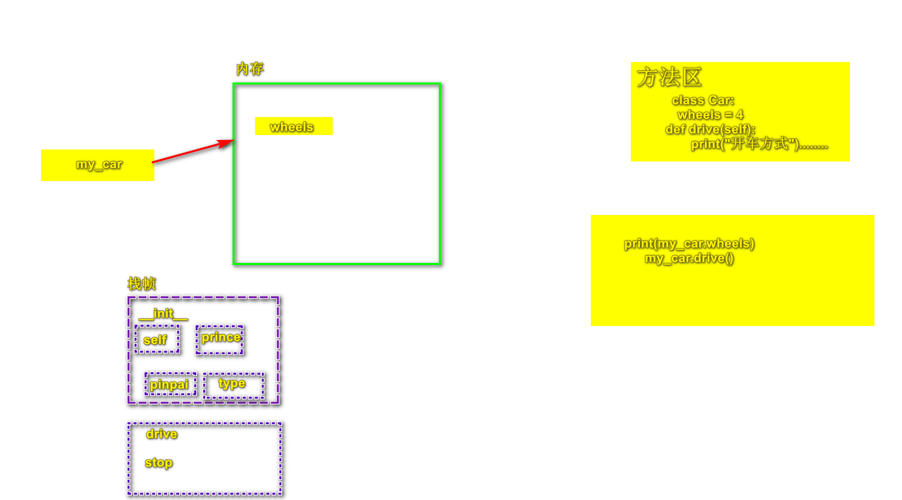
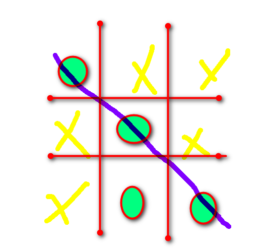
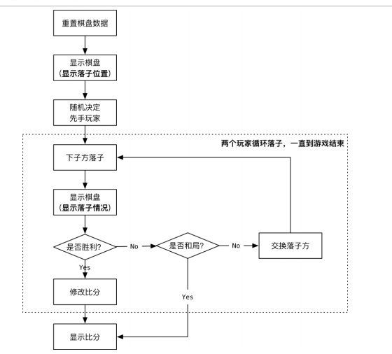

# 类与面向对象Object Oriented

​	面向对象是程序领域开发中的重要思想，是当前计算机软件工程学的主流方法，而类是面向对象的实现手段。

- 对象：现实中可以描述的事物，归属于某个类别的个体；
- 类：从具体事物中抽取共同的特征，形成一个类别；
- 类是创建对象的模板。


## 1.类与对象

​	面向对象编程思想力求在程序中对事物的描述与该事物在现实中的形态保持一致。为此类的概念就产生了。某一些事物中具有相同的特征，我们称这一些事物为某类。如汽车有品牌、价格等的不同，但我们都具备了出行的功能，所以无论是奔驰宝马，还是货车客车，我们都称之为汽车这一类。


### 1.1.类的定义

​	在程序中创建对象先要定义类，类是对象的抽象态。类的定义格式如下：

```python
class 类名:							#  定义类名
    属性名=属性值						 #  定义属性
    def 方法名(self):   			   #  定义方法
        方法体
```

```python
class 类名:
	“””文档说明”””
	def _init_(self,参数列表):
		self.实例变量 = 参数
	方法成员
```

- 类名所有单词首字母大写；
- __init__也叫构造函数，创建对象时被调用，每个类都默认有自己的构造方法，所以可以被省略；
- self变量绑定的是被创建的对象，名称可以随意.

如定义汽车Car类的方式如下：

```python
class Car:
    wheels = 4
    def drive(self):
		print("开车方式")
    def stop(self):
        print("停车方式")
    def car(self):
        self.car=self
```


### 1.2.对象的定义

​	对象是类中的抽象，我们定义完类后还不能使用，就好比一张房屋的设计图，只有结构，但不能入住。所以类需要实例化成对象后才能实现其意义。对象的创建格式如下：

```python
对象名=类名()
```

​	对象的创建是由类中的构造函数实现的。如定义Car类的对象my_car：

```python
mycar=Car()
```

​	有了这个对象后就可以访问这个对象的属性和方法，访问格式如下：

```python
对象名.属性						# 访问对象的属性
对象名.方法()					# 访问对象的方法
```

​	如要访问my_car对象的wheels属性和drive()方法的具体实现为：

```python
print(my_car.wheels)
my_car.drive()
```




### 1.3.访问权限

​	类中定义的属性和方法默认都是公有的，该类的对象可以任意访问到公有成员，但考虑到封装思想，类中的代码不应该被轻易的访问。所以为了契合封装原则，Python支持将类中的成员设置为私有成员，一定程度上限制对象对类成员的访问。Python通过在类成员名之前加双下划线(__)来限制成员的访问，格式如下：

```python
__属性名

__方法名
```

​	以上用__定义的类成员我们称之为私有成员。如一个人的体重和信息是保密的，我们可以定义成私有的成员：

```python
class PersonInfo:
    __weight=55
    def __info(self):
        print(f"我的体重是：{__weifht}")
```

​	对于私有成员的访问，我们可以直接创建类的对象，然后通过该对象访问类的私有属性：

```python
person = PersonInfo()
person.__weight
person.__info()
#  以上两个访问私有成员的方法都会报错，所以我们知道对象是无法直接访问私有成员的
```

​	通过以上案例我们得知，对象无法直接访问类的私有成员，那么我们该怎么才能访问到类的私有属性和私有方法呢？

- **访问私有属性：**私有属性可在共有方法中通过指代类本身的默认参数self访问，类外部可通过共有方法间接获取类的私有属性。以类PersonInfo为例，在其方法中添加访问私有属性__weight的代码：

```python
class PersonInfo:
    __weight = 55
    def get_weight(self):
		print(f'体重：{self.__weight}kg')
```

​	创建PersonInfo类的对象person，访问公共方法get_weight()，就可以得到属性值：

```python
person = PersonInfo()
person.get_weight()
```

- **访问私有方法：**私有方法同样需要在共有方法中通过参数self访问，修改PersonInfo类，在私有方法__info()中通过self访问私有属性__weight，并在共有方法get_weight()中通过self参数访问私有__info()：

```python
class PersonInfo:
    __weight = 55
    def __info(self):
        print(f"我的体重是：{self.__weight}")
    def get_weight(self):
        print(f'体重：{self.__weight}kg')
        self.__info()
```

​	创建对象person，访问共有方法get_weight():

```python
person = PersonInfo()
person.get_weight()
```


### 1.4.练习

创建学生类，要求数据成员有姓名、年龄、成绩、性别，并在控制台打印。

```python
class Student:
    def __init__(self, name, age, score, sex):
        self.name = name
        self.age = age
        self.score = score
        self.sex = sex

    def print_self_info(self):
        print("%s的年龄是%d,成绩是%d,性别是%s" % (self.name, self.age, self.score, self.sex))


student = Student("张无忌", 30, 100, "男")
student.print_self_info()
```


### 1.5.构造方法与析构方法

​	类中有两个特殊的方法：构造方法__init__()和析构方法__del__()，这两个方法分别在类创建和销毁时自动调用。


#### 1.5.1.构造方法

​	每个类都有一个默认的__init__()方法，如果在定义类时显示的定义了__init__()方法，则创建对象时Python解释器会调用显示定义的__init__()方法，如果没有显示定义，则Python解释器则会调用默认的__init__()方法。

​	__init__方法可以根据参数(self除外)分为有参构造方法和无参构造方法，无参构造可以为属性设置初始值，此时使用该方法创建的所有对象都具有相同的初始值；若希望每次创建对象都有不同的初始值，则可以使用有参构造来实现。

```python
class Infomation(object):
    def __init__(self, name, sex):  # 定义有参构造方法
        self.name = name  # 添加属性name
        self.sex = sex  # 添加属性sex
    def info(self):
        print(f'姓名：{self.name}')
        print(f'性别：{self.sex}')
```

​	上述代码包含了3个参数的构造方法的Infomation类，然后通过参数name与sex为属性name和sex赋值，最后再info()方法中访问这两个属性的值。

```python
infomation = Infomation("张三","男")
ingfomation.info()
```


#### 1.5.2.析构方法

​	再创建对象时，系统自动调用__init__()方法，在对象被清理时，系统也会自动调用一个__del__()方法，这个方法就是类的析构方法。

​	Python中的垃圾回收主要采用的是引用计数。引用计数是一种内存管理技术，它通过引用计数器记录所有对象的引用数量，当对象的引用计数器数值为0时，它就会对该对象视为垃圾进行回收。getrefcount()函数时sys模块中用于统计对象引用数量的函数，其返回的结果通常比预期的结果大1，这时因为getrefcount()函数也会统计临时对象的引用。当一个对象的引用计数器数值为0时，它就会调用__del__()方法：

```python
import sys


class Destruction:
    def __init__(self):
        print("对象被创建。。。")

    def __del__(self):
        print("对象被销毁。。。")


destruction = Destruction()
print(sys.getrefcount(destruction))
```

​	从上述输出结果来看，对象被创建后计数器的值变为2，由于返回引用计数器的值时就会增加一个临时引用，所以对象引用计数器的实际值为1。


### 1.6.类方法和静态方法

​	比普通方法多一个self参数的方法就是类的实例方法，它只能通过类的实例化的对象调用，此外，Python中的类还可以使用@classmethod修饰类的方法，使用@staticmethod修饰静态方法。


#### 1.6.1.类方法

​	类方法和实例方法有所不同，主要体现在以下几点：

- 类方法使用装饰器@classmethod修饰；
- 类方法的第一个参数时cls，而不是self，它代表类的本身；
- 类方法即可由对象调用，也可直接由类调用；
- 类方法可以修改类属性，以及如何使用类方法修改类属性。

**定义语法：**

```python
类名.方法名
对象名.类方法
```

```python
class Test:
    @classmethod
    def use_classmet(cls):
        print("这是类方法。。。")
test = Test()
test.use_classmet()  # 对象名调用类方法
Test.use_classmet()  # 类调用类方法
```


**修改类的属性：**

​	在实例方法中无法修改类的属性值，但在类方法中可以将类属性的值进行修改。

```python
class Apple(object):
    count = 0

    def add_one(self):
        self.count = 1

    @classmethod
    def add_two(cls):
        cls.count = 2
apple = Apple()
apple.add_one()
print(Apple.count)
Apple.add_two()
print(Apple.count)
# 0 
# 2
```

​	从输出结果可以看出，调用实例方法add_one()后的数值为0，说明属性count的值并没有修改，调用add_two()后的数值为2，说明类属性count的值被修改了。通过"self.count = 1"只是创建了一个与类属性同名的实例属性count，并将其赋值为1，而非对类属性重新赋值。通过对象apple访问count属性就会让其数值增加：

```python
print(apple.count)
# 1
```


#### 1.6.2.静态方法

静态方法与实例方法有以下几点的不同：

- 静态方法没有self参数，它需要使用@staticmethod修饰；
- 静态方法中需要以“类名.方法/属性名”的形式访问类成员；
- 静态方法即可有对象调用，也可由类直接调用。

```python
class Example:
    num = 10
    @staticmethod
    def static_method():
        print(f"类的属性值为：{Example.num}")
        print("这是类的静态方法。。。")
example = Example()
example.static_method()  # 可以由对象调用
Example.static_method()  # 也可以由类直接调用
```


​	类方法和静态方法的主要区别是在于类方法有一个cls参数，使用该参数可以在类方法中访问类的成员，静态方法没有任何参数，它无法使用默认的参数访问类的成员。所以静态方法更适合操作和类无关的事情。


## 2.继承

​	和其他语言一样，Python在类鱼类之间也具有继承关系，其中被继承的类称为父类，派生的类称为子类，子类在继承父类时，会自动调用父类中的方法和属性。与Java不同的是，python不仅支持单继承，还支持多继承。


### 2.1.单继承

​	单继承只子类只能继承一个父类，语法格式为：

```python
class 子类(父类):
```

​	比如子类青蛙Frog继承两栖动物Amphibian：

```python
class Amphibian:
    name = "两栖动物"
    def features(self):
        print("幼年用鳃呼吸。。。")
        print("成年用肺呼吸")

class Frog(Amphibian):
    def attr(self):
        print(f"青蛙是{self.name}")
        print("呱呱叫。。。")

frog = Frog()
print(frog.name)
frog.features()
frog.attr()
```

​	从输出结果可以看出，子类继承父类后，就拥有了父类的属性和方法，它既可以调用父类的方法，也可以调用自己的方法。

​	Python中提供了两个和继承相关的函数，分别是isinstance()和issubclass()。isinstance(o,t)函数用于检查对象的类型，它有两个参数，第一个参数是要判断类型的对象(o)，第二个参数是类型(t)，如果o是t类型的对象，则返回True，否则返回False。

```python
print(isinstance(frog, Frog))
```

 	函数issubclass(cls,classinfo)用于检查类的继承关系，它也有两个参数，第一个参数是要判断的子类类型(cls)，第二个参数是要判断的父类类型(classinfo)，如果cls类型是classinfo类型的子类，则返回True,否则返回False。

```python
print(issubclass(Frog, Amphibian))
```

### 

### 2.2.多继承

​	多继承是指一个类继承多个父类，语法结构为：

```python
class 子类(父类A, 父类B)
```

​	如一个学生接收多个老师传授知识，定义English类、Math类、Student类，使Student类继承English类和Math类：

```python
class English:
    def know_english(self):
        print("会英语")

class Math:
    def know_math(self):
        print("会数学")

class Student(English, Math):
    def study(self):
        print("学生的任务是学习")

s = Student()
s.know_math()
s.know_english()
s.study()
```


### 2.3.方法重写

​	子类可以继承父类的属性和方法，若父类的方法不能满足子类的要求，子类可以将父类的方法进行重写，以实现理想的功能。

​	定义Felines类与Cat类，使Cat类继承Felines类，并重写父类继承的speciality()方法：

```python
class Felines:
    def speciality(self):
        print("猫科动物的特长是爬树")


class Cat(Felines):
    name = "猫"
    def speciality(self):
        print(f'{self.name}会抓老鼠。。。')
        print(f"{self.name}会爬树")

cat = Cat()
cat.speciality()
```


### 2.4.super()函数

​	如果子类重写了父类的方法，但仍希望调用父类的方法，Python和Java一样也提供了super()函数，使用该函数可以调用父类中的方法：

```python
super.方法名()
```

```python
class Cat(Felines):
    name = "猫"
    def speciality(self):
        print(f'{self.name}会抓老鼠。。。')
        print(f"{self.name}会爬树")
        print("-"*20)
        super().speciality()

cat = Cat()
cat.speciality()
```

​	从结果可以看出，通过super()函数可以访问被重写的父类方法。


### 2.5.练习：井字棋

​	井字棋是一种在3*3的格子上进行的连珠游戏，两名玩家，其中一个画圈，另一个画叉，轮流在3x3的格子上画自己的符号，最先在横向、纵向或斜线方法连城一条线的人为胜利方，编写程序，实现具有人机交互功能的井字棋：





```python
import random
import board


class Player(object):
    """玩家类"""

    def __init__(self, name):
        self.name = name  # 姓名
        self.score = 0  # 成绩
        self.chess = None  # 棋子

    def move(self, chess_board):
        """在棋盘上落子

        :param chess_board:
        """
        # 1. 由用户输入要落子索引
        index = -1
        while index not in chess_board.movable_list:
            try:
                index = int(input("请 “%s” 输入落子位置 %s：" %
                                  (self.name, chess_board.movable_list)))
            except ValueError:
                pass

        # 2. 在指定位置落子
        chess_board.move_down(index, self.chess)


class AIPlayer(Player):
    """智能玩家"""

    def move(self, chess_board):
        """在棋盘上落子

        :param chess_board:
        """
        print("%s 正在思考落子位置..." % self.name)

        # 1. 查找我方必胜落子位置
        for index in chess_board.movable_list:
            if chess_board.is_win(self.chess, index):
                print("走在 %d 位置必胜！！！" % index)
                chess_board.move_down(index, self.chess)

                return

        # 2. 查找地方必胜落子位置-我方必救位置
        other_chess = "O" if self.chess == "X" else "X"

        for index in chess_board.movable_list:
            if chess_board.is_win(other_chess, index):
                print("敌人走在 %d 位置必输，火速堵上！" % index)
                chess_board.move_down(index, self.chess)

                return

        # 3. 根据子力价值选择落子位置
        index = -1
        # 没有落子的角位置列表
        corners = list(set([0, 2, 6, 8]).intersection(chess_board.movable_list))
        # 没有落子的边位置列表
        edges = list(set([1, 3, 5, 7]).intersection(chess_board.movable_list))

        if 4 in chess_board.movable_list:
            index = 4
        elif corners:
            index = random.choice(corners)
        elif edges:
            index = random.choice(edges)

        # 在指定位置落子
        chess_board.move_down(index, self.chess)


if __name__ == '__main__':
    # 1. 创建棋盘对象
    chess_board = board.Board()

    # 2. 创建玩家对象
    human = Player("玩家")
    human.chess = "X"

    # 3. 玩家在棋盘上循环落子，直到玩家胜利
    while not chess_board.is_win(human.chess):
        human.move(chess_board)

        # 显示棋盘
        chess_board.show_board()
```

```python
class Board(object):
    """棋盘类"""

    def __init__(self):
        self.board_data = [" "] * 9  # 棋盘数据
        self.movable_list = list(range(9))  # 可移动列表

    def show_board(self, show_index=False):
        """显示棋盘

        :param show_index: True 表示显示索引 / False 表示显示数据
        """
        for i in (0, 3, 6):
            print("       |       |")

            if show_index:
                print("   %d   |   %d   |   %d" % (i, i + 1, i + 2))
            else:
                print("   %s   |   %s   |   %s" % (self.board_data[i],
                                                   self.board_data[i + 1],
                                                   self.board_data[i + 2]))
            print("       |       |")

            if i != 6:
                print("-" * 23)

    def move_down(self, index, chess):
        """在指定位置落子

        :param index: 列表索引
        :param chess: 棋子类型 X 或 O
        """
        # 1. 判断 index 是否在可移动列表中
        if index not in self.movable_list:
            print("%d 位置不允许落子" % index)
            return

        # 2. 修改棋盘数据
        self.board_data[index] = chess

        # 3. 修改可移动列表
        self.movable_list.remove(index)

    def is_draw(self):
        """是否平局"""
        return not self.movable_list

    def is_win(self, chess, ai_index=-1):
        """是否胜利

        :param chess: 玩家的棋子
        :param ai_index: 预判索引，-1 直接判断当前棋盘数据
        """

        # 1. 定义检查方向列表
        check_dirs = [[0, 1, 2], [3, 4, 5], [6, 7, 8],
                      [0, 3, 6], [1, 4, 7], [2, 5, 8],
                      [0, 4, 8], [2, 4, 6]]

        # 2. 定义局部变量记录棋盘数据副本
        data = self.board_data.copy()

        # 判断是否预判胜利
        if ai_index > 0:
            data[ai_index] = chess

        # 3. 遍历检查方向列表判断是否胜利
        for item in check_dirs:
            if (data[item[0]] == chess and
                data[item[1]] == chess
                    and data[item[2]] == chess):

                return True

        return False

    def reset_board(self):
        """重置棋盘"""
        # 1. 清空可移动列表数据
        self.movable_list.clear()

        # 2. 重置数据
        for i in range(9):
            self.board_data[i] = " "
            self.movable_list.append(i)


if __name__ == '__main__':

    # 1. 测试初始化
    board = Board()
    print(board.board_data)
    print(board.movable_list)

    # 2. 显示棋盘
    print("--- 显示棋盘" + "-" * 50)
    board.show_board(True)  # 显示索引
    print("-" * 50)
    board.show_board()  # 显示数据

    # 3. 测试落子
    print("--- 测试落子" + "-" * 50)
    board.move_down(0, "X")
    board.show_board()
    print(board.movable_list)

    board.move_down(0, "X")  # 测试在已有棋子的位置落子

    # 4. 判断平局
    # print("--- 判断平局" + "-" * 50)
    # print("是否平局 %d" % board.is_draw())
    # board.movable_list.clear()  # 清空可移动索引列表
    # print("是否平局 %d" % board.is_draw())

    # 5. 判断胜利
    print("---判断胜利" + "-" * 50)
    print("是否胜利 %d" % board.is_win("X"))
    board.move_down(0, "X")
    board.move_down(1, "X")
    board.move_down(2, "X")
    board.show_board()
    print("是否胜利 %d" % board.is_win("X"))

    # 6. 测试重置棋盘数据
    print("--- 重置棋盘" + "-" * 50)
    board.reset_board()
    board.show_board()
    print(board.movable_list)

```

```python
import random
import board
import player


class Game(object):
    """游戏类"""

    def __init__(self):
        self.chess_board = board.Board()  # 棋盘对象
        self.human = player.Player("玩家")  # 人类玩家对象
        self.computer = player.AIPlayer("电脑")  # 电脑玩家对象

    def random_player(self):
        """随机先手玩家

        :return: 落子先后顺序的玩家元组
        """

        # 随机到 1 表示玩家先手
        if random.randint(0, 1) == 1:
            players = (self.human, self.computer)
        else:
            players = (self.computer, self.human)

        # 设置玩家棋子
        players[0].chess = "X"
        players[1].chess = "O"

        print("根据随机抽取结果 %s 先行" % players[0].name)

        return players

    def play_round(self):
        """一轮完整对局"""
        # 1. 显示棋盘落子位置
        self.chess_board.show_board(True)

        # 2. 随机决定先手
        current_player, next_player = self.random_player()

        # 3. 两个玩家轮流落子
        while True:
            # 下子方落子
            current_player.move(self.chess_board)

            # 显示落子结果
            self.chess_board.show_board()

            # 是否胜利？
            if self.chess_board.is_win(current_player.chess):
                print("%s 战胜 %s" % (current_player.name, next_player.name))

                current_player.score += 1

                break

            # 是否平局
            if self.chess_board.is_draw():
                print("%s 和 %s 战成平局" % (current_player.name, next_player.name))

                break

            # 交换落子方
            current_player, next_player = next_player, current_player

        # 4. 显示比分
        print("[%s] 对战 [%s] 比分是 %d : %d" % (self.human.name,
                                            self.computer.name,
                                            self.human.score,
                                            self.computer.score))

    def start(self):
        """循环开始对局"""

        while True:
            # 一轮完整对局
            self.play_round()

            # 询问是否继续
            is_continue = input("是否再来一盘（Y/N）？").upper()

            # 判断玩家输入
            if is_continue != "Y":
                break

            # 重置棋盘数据
            self.chess_board.reset_board()


if __name__ == '__main__':
    Game().start()

```


## 3.多态

​	在Python中，多态指在不考虑对象类型的情况下使用对象，相比于Java等强类型语言，Python更推崇“鸭子类型":如果一只生物走起路来像鸭子，叫起来也像鸭子，那么它就可以被当作鸭子。也就是说不关注对象的类型，而是关注对象具有的行为。

```python
class Animal:
    def move(self):
        pass

class Rabbit(Animal):
    def move(self):
        print("兔子可以蹦蹦跳跳")

class Snail(Animal):
    def move(self):
        print("蜗牛可以爬行")

# 在函数test()中调用了对象obj的move()方法
def test(obj):
    obj.move()

rabbit = Rabbit()
test(rabbit)
snail = Snail()
test(snail)
```

​	分析运行结果可知，同一个函数会根据参数的类型去调用不同的方法，从而产生不同的结果。