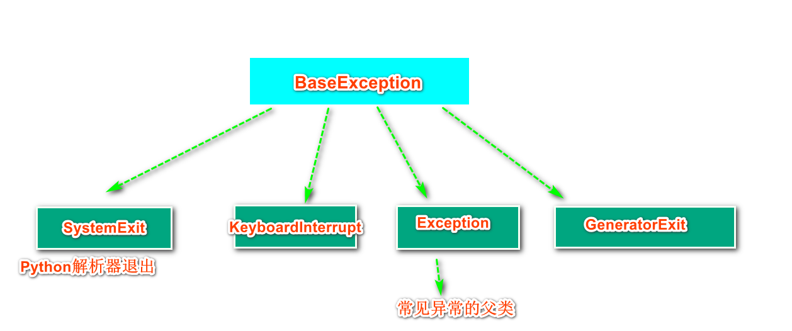
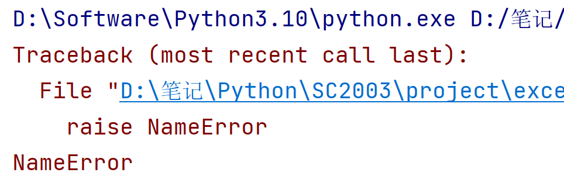
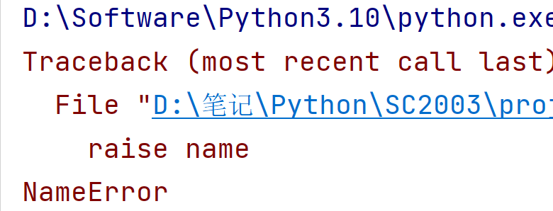
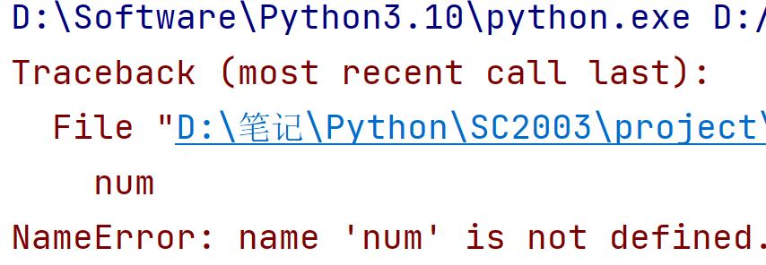
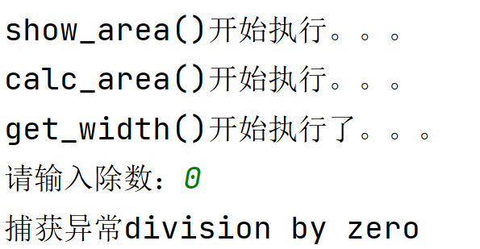
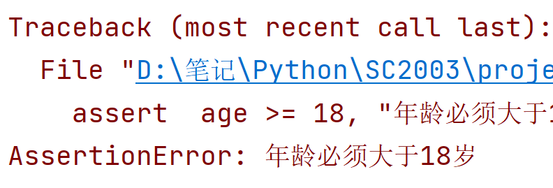

# 错误和异常


## 1.概述

​	Python程序最常见的错误是语法错误。这是因为开发者编写了不符合Python语法的代码所引起的错误，含有语法错误的程序无法被解释器解释，必须经过修正后程序才能正常运行。比如在程序中出现了符号缺失或0整除：

```python
while True
    print("语法错误")
    
----------------------
a = 1/0
```

上述示例代码都有语法错误，因此没办法解析，会报SyntaxError的错误。Python中所有的异常均由类实现，所有的异常都继承自类BaseException。BaseException包含4个子类，其中子类Exception是大多数常见异常类的父类，如SyntaxError，ZeroDivisionError等都是其子类。



- Exception常见的子类如下：

| 类名              | 描述                       |
| ----------------- | -------------------------- |
| SyntaxError       | 语法错误                   |
| FileNotFoundError | 未找到指定文件或目录       |
| NameError         | 找不到指定名称的变量       |
| ZeroDivisionReeor | 除数为0                    |
| IndexErorr        | 使用超出列表范围的索引     |
| KeyError          | 使用字典不存在的键         |
| AttributeError    | 尝试访问位置对象属性时引发 |
| TypeError         | 类型错误                   |


## 2.捕获异常

​	Python程序在运行时出现的异常会导致程序崩溃，因此开发人员需要使用友好的方式处理程序运行时的异常。Python中使用try---except语句捕获异常，它还可以与else、finally组合使用实现更强大的异常处理。


### 2.1.try...except语句

语法格式为：

```shell
try:
	可能出现异常的代码
except 异常类型：
	错误处理语句
```

try...except语句的执行过程为：

1. 限制性try子句；
2. 若try子句没有出现异常，则忽略except子句中的代码；
3. 若try子句产生异常，则忽略try子句中剩余的代码，执行except子句的代码。

```python
# try...except语句
try:
    a = 5 / 0
except:
    print("0不能作为除数。")
```


### 2.2.捕获异常信息

​	try...except语句可以捕获和处理程序运行时的单个异常、多个异常、所有异常，也可以在except子句中使用关键字as获取系统反馈的异常的具体信息：

- **捕获程序运行时的单个异常：**需要在except子句中指定具体的异常类。

```python
try:
    a = 5 / 0
except ZeroDivisionError as e:
    print(f"异常原因:{e}")
    
# 如果指定的异常和程序所产生的异常不一致，程序运行仍会崩溃
```


- **捕获程序运行时的多个异常：**将多个异常放到元组里进行处理。

```python
try:
    print(name)
    list01 = ["python", "java", "C", "C++"]
    print(list01[5])
except (NameError, IndexError) as e:
    print(f"异常原因{e}")
```

​	在上述代码中，只能输出第一个异常，因为程序解释器在遇到第一个异常后就去执行except语句里的内容，所以并不会输出IndexError的异常。也可以尝试拆分except子句变成以下结构：

```python
try:
    print(name)
    list01 = ["python", "java", "C", "C++"]
    print(list01[5])
except NameError as e:
    print(f"异常原因{e}")
except IndexError as e:
    print(f"异常原因{e}")  
```

- **捕获所有异常：**捕获所有的异常可以有两种方式，捕获异常类的父类Exception；省略异常类。

```shell
try:
    print(name)
    list01 = ["python", "java", "C", "C++"]
    print(list01[5])
# except Exception as e:
#    print(f"异常原因{e}")
except:
	print("程序出现异常，原因未知")
```

### 2.3.else子句

​	异常处理的主要目的时放置外部环境变化导致程序产生无法控制的错误，而不是处理程序的设计错误。因此将所有代码都用try子句包含起来的做法是不推荐的，try子句应尽量只包含可能产生异常的代码，当try子句出现错误时应执行else语句中的代码，格式为：

```python
try:
    可能出现错误的语句
except:
    出错后执行的语句
else:
    未出错执行的语句
```

​	如某程序员的分页显示功能可以根据用户输入控制每页显示多少条数据，但要求用户输入的数据为整数类型，如果输入数据符合要求则显示，如果不符合要求，则显示默认条数的数据：

```python
# else子句
num = input("请输入分页显示的数据条数：")
try:
    page_size = int(num)
except Exception as e:
    page_size = 20
    # 不符合输入要求，显示20页默认数据
    print(f"当前页显示{page_size}条数据")
else:
    # 符合要求，显示输入数字的页数
    print(f"当前页显示{num}条数据")
```

以上程序当输入正常时会显示出入的数据，输入不符合要求时，会展示默认20条数据。


### 2.4.finally子句

​	finally子句和try...except语句连用时，无论try...except是否捕获到异常，finally子句后的代码都会被执行，语法格式为：

```python
try:
    可能出错的语句
except：
	出错后执行的语句
finally:
    一定会被执行的语句
```

​	Python在处理文件时，为避免打开的文件占用过多资源，在完成对文件的操作后需要使用close()方法关闭文件。为了确保文件一定会被关闭，可以将关闭操作放在finally子句中。

```python
# finally子句
try:
    file = open("异常.txt",'r')
    file.write("人生苦短，快用python")
except Exception as e:
    print("写入文件失败",e)
finally:
    file.close()
    print("文件已关闭")
```


## 3.抛出异常

​	Python程序中的异常不仅可以由系统抛出，还可以由开发人员使用关键字raise主动抛出。只要异常没有被处理就会被向上传递，直至最顶层已没有被处理，则会使用系统默认的方式处理（程序崩溃）。另外还可以使用assert语句检测一个表达式是否符合要求，不符合要求则抛出异常。


### 3.1.raise语句

raise语句用于引发特定的异常，使用方法大致可分为以下3种：

- 由异常类名引发异常；
- 由异常对象引发异常；
- 由程序中出现过的异常引发异常。

#### 3.1.1.由类名引发异常

在raise语句后添加具体的异常类，使用类名引发异常，语法格式如下：

```python
raise 异常类名
```

当raise语句指定了异常的类名时，Python解释器会自动创建该异常类的对象，进而引发异常。

```python
raise NameError
```

运行结果：



#### 3.1.2.使用对象引发异常

使用类名引发异常的语法格式如下：

```python
raise 异常对象
```

```python
name = NameError
raise name
```

运行结果：



#### 3.1.3.由异常引发异常

仅使用关键字raise可重新引发刚才发生的异常，语法格式如下：

````python
raise
````

例如：

```python
try:
    num
except NameError as e:
    raise
```

运行结果如下：




### 3.2.异常的传递

​	如果程序中的异常没有被处理，默认情况下会将该异常传递给上一级，如果上一级仍然没有处理，会继续向上传递，直至异常被处理或程序崩溃。

​	以下案例通过计算一个正方形面积的示例演示异常的传递。程序中共包含3个函数：get_width()用于计算正方形的边长；calc_area()用于计算正方形面积；show_area()用于展示计算正方形的面积：

```python
# 计算正方形面积演示异常的传递
# 计算边长
def get_width():
    print("get_width()开始执行了。。。")
    num = int(input("请输入除数："))
    # 发生异常
    width_len = 10/num
    print("get_width()执行结束。。。")
    return width_len
# 计算正方形面积
def calc_area():
    print("calc_area()开始执行。。。")
    width_len = get_width()
    print("calc_area()结束执行。。。")
    return width_len * width_len
# 展示数据
def show_area():
    try:
        print("show_area()开始执行。。。")
        area_val = calc_area()
        print(f"正方形的面积是：{area_val}")
        print("show_area()结束执行。。。")
    except ZeroDivisionError as e:
        print(f"捕获异常{e}")

if __name__ == '__main__':
    show_area()
```

​	上述代码get_width()函数使用变量num接收用户接收的除数，通过 width_len = 10/num计算正方形的边长，如果输入的为0，程序会引发ZeroDivisionError异常。因为get_width()函数中并没有捕获异常的语句，所以get_width()函数的异常向上传递给calc_area()函数，而calc_area()函数中也没有捕获异常的处理，只能将一场信息继续向上传递给sow_area()。

执行结果：



### 3.3.assert断言语句

​	assert断言语句用于判断一个表达式是否为真，如果为True，不做任何操作，否则引发AssertError的异常。其语法格式如下：

```python
assert 表达式[,参数]
```

表达式时assert语句的判定对象，参数通常是一个自定义的描述异常具体信息的字符串。

判断一个会员管理系统要求会员的年龄必须大于18岁，则可以对年龄进行断言:

```python
age = 17
assert  age >= 18, "年龄必须大于18岁"
```

以上代码表达式值为False，所以系统抛出了AssertError异常，并显示了异常信息：



​	**assert断言语句多用于程序开发测试阶段，主要目的是确保代码的正确性。如果开发人员能确保程序正常执行，那么不建议使用assert语句抛出异常。**